# FromWechat
## 1. 神经网络浅讲：从神经元到深度学习

神经网络是一种模拟人脑的神经网络以期能够实现类人工智能的机器学习技术。

设计一个神经网络时，输入层与输出层的节点数往往是固定的，中间层则可以自由指定。

事实上，神经网络的本质就是通过参数与激活函数来拟合特征与目标之间的真实函数关系。

与单层神经网络不同。理论证明，两层神经网络可以无限逼近任意连续函数。

我们知道，矩阵和向量相乘，本质上就是对向量的坐标空间进行一个变换。因此，隐藏层的参数矩阵的作用就是使得数据的原始坐标空间从线性不可分，转换成了线性可分。

两层神经网络通过两层的线性模型模拟了数据内真实的非线性函数。因此，多层的神经网络的本质就是复杂函数拟合。

在设计一个神经网络时，输入层的节点数需要与特征的维度匹配，输出层的节点数要与目标的维度匹配。而中间层的节点数，却是由设计者指定的。因此，“自由”把握在设计者的手中。但是，节点数设置的多少，却会影响到整个模型的效果。如何决定这个自由层的节点数呢？目前业界没有完善的理论来指导这个决策。一般是根据经验来设置。较好的方法就是预先设定几个可选值，通过切换这几个值来看整个模型的预测效果，选择效果最好的值作为最终选择。这种方法又叫做Grid Search（网格搜索）。

机器学习模型训练的目的，就是使得参数尽可能的与真实的模型逼近。

下面的问题就是求：如何优化参数，能够让损失函数的值最小。

一般来说解决这个优化问题使用的是梯度下降算法。梯度下降算法每次计算参数在当前的梯度，然后让参数向着梯度的反方向前进一段距离，不断重复，直到梯度接近零时截止。一般这个时候，所有的参数恰好达到使损失函数达到一个最低值的状态。

在神经网络模型中，由于结构复杂，每次计算梯度的代价很大。因此还需要使用反向传播算法。反向传播算法是利用了神经网络的结构进行的计算。不一次计算所有参数的梯度，而是从后往前。首先计算输出层的梯度，然后是第二个参数矩阵的梯度，接着是中间层的梯度，再然后是第一个参数矩阵的梯度，最后是输入层的梯度。计算结束以后，所要的两个参数矩阵的梯度就都有了。

反向传播算法的启示是数学中的链式法则。在此需要说明的是，尽管早期神经网络的研究人员努力从生物学中得到启发，但从BP算法开始，研究者们更多地从数学上寻求问题的最优解。不再盲目模拟人脑网络是神经网络研究走向成熟的标志。正如科学家们可以从鸟类的飞行中得到启发，但没有必要一定要完全模拟鸟类的飞行方式，也能制造可以飞天的飞机。

神经网络仍然存在若干的问题：尽管使用了BP算法，一次神经网络的训练仍然耗时太久，而且困扰训练优化的一个问题就是局部最优解问题，这使得神经网络的优化较为困难。同时，隐藏层的节点数需要调参，这使得使用不太方便，工程和研究人员对此多有抱怨。

90年代中期，由Vapnik等人发明的SVM（Support Vector Machines，支持向量机）算法诞生，很快就在若干个方面体现出了对比神经网络的优势：无需调参；高效；全局最优解。基于以上种种理由，SVM迅速打败了神经网络算法成为主流。

2006年，Hinton在《Science》和相关期刊上发表了论文，首次提出了“深度信念网络”的概念。与传统的训练方式不同，“深度信念网络”有一个“预训练”（pre-training）的过程，这可以方便的让神经网络中的权值找到一个接近最优解的值，之后再使用“微调”(fine-tuning)技术来对整个网络进行优化训练。这两个技术的运用大幅度减少了训练多层神经网络的时间。他给多层神经网络相关的学习方法赋予了一个新名词–“深度学习”。

与两层层神经网络不同。多层神经网络中的层数增加了很多。增加更多的层次有什么好处？更深入的表示特征，以及更强的函数模拟能力。更深入的表示特征可以这样理解，随着网络的层数增加，每一层对于前一层次的抽象表示更深入。在神经网络中，每一层神经元学习到的是前一层神经元值的更抽象的表示。例如第一个隐藏层学习到的是“边缘”的特征，第二个隐藏层学习到的是由“边缘”组成的“形状”的特征，第三个隐藏层学习到的是由“形状”组成的“图案”的特征，最后的隐藏层学习到的是由“图案”组成的“目标”的特征。通过抽取更抽象的特征来对事物进行区分，从而获得更好的区分与分类能力。更强的函数模拟能力是由于随着层数的增加，整个网络的参数就越多。而神经网络其实本质就是模拟特征与目标之间的真实关系函数的方法，更多的参数意味着其模拟的函数可以更加的复杂，可以有更多的容量（capcity）去拟合真正的关系。

通过研究发现，在参数数量一样的情况下，更深的网络往往具有比浅层的网络更好的识别效率。这点也在ImageNet的多次大赛中得到了证实。从2012年起，每年获得ImageNet冠军的深度神经网络的层数逐年增加，2015年最好的方法GoogleNet是一个多达22层的神经网络。

在单层神经网络时，我们使用的激活函数是sgn函数。到了两层神经网络时，我们使用的最多的是sigmoid函数。而到了多层神经网络时，通过一系列的研究发现，ReLU函数在训练多层神经网络时，更容易收敛，并且预测性能更好。因此，目前在深度学习中，最流行的非线性函数是ReLU函数。ReLU函数不是传统的非线性函数，而是分段线性函数。其表达式非常简单，就是y=max(x,0)。简而言之，在x大于0，输出就是输入，而在x小于0时，输出就保持为0。这种函数的设计启发来自于生物神经元对于激励的线性响应，以及当低于某个阈值后就不再响应的模拟。

在多层神经网络中，训练的主题仍然是优化和泛化。当使用足够强的计算芯片（例如GPU图形加速卡）时，梯度下降算法以及反向传播算法在多层神经网络中的训练中仍然工作的很好。目前学术界主要的研究既在于开发新的算法，也在于对这两个算法进行不断的优化，例如，增加了一种带动量因子（momentum）的梯度下降算法。

在深度学习中，泛化技术变的比以往更加的重要。这主要是因为神经网络的层数增加了，参数也增加了，表示能力大幅度增强，很容易出现过拟合现象。因此正则化技术就显得十分重要。目前，Dropout技术，以及数据扩容（Data-Augmentation）技术是目前使用的最多的正则化技术。

多层神经网络的研究仍在进行中。现在最为火热的研究技术包括RNN，LSTM等，研究方向则是图像理解方面。图像理解技术是给计算机一幅图片，让它用语言来表达这幅图片的意思。ImageNet竞赛也在不断召开，有更多的方法涌现出来，刷新以往的正确率。

冷静才是对待目前深度学习热潮的最好办法。如果因为深度学习火热，或者可以有“钱景”就一窝蜂的涌入，那么最终的受害人只能是自己。神经网络界已经两次有被人们捧上天了的境况，相信也对于捧得越高，摔得越惨这句话深有体会。因此，神经网络界的学者也必须给这股热潮浇上一盆水，不要让媒体以及投资家们过分的高看这门技术。很有可能，三十年河东，三十年河西，在几年后，神经网络就再次陷入谷底。根据上图的历史曲线图，这是很有可能的。

下面说一下神经网络为什么能这么火热？简而言之，就是其学习效果的强大。随着神经网络的发展，其表示性能越来越强。

从单层神经网络，到两层神经网络，再到多层神经网络，随着网络层数的增加，以及激活函数的调整，神经网络所能拟合的决策分界平面的能力。可以看出，随着层数增加，其非线性分界拟合能力不断增强。神经网络的研究与应用之所以能够不断地火热发展下去，与其强大的函数拟合能力是分不开关系的。

当然，光有强大的内在能力，并不一定能成功。一个成功的技术与方法，不仅需要内因的作用，还需要时势与环境的配合。神经网络的发展背后的外在原因可以被总结为：更强的计算性能，更多的数据，以及更好的训练方法。只有满足这些条件时，神经网络的函数拟合能力才能得已体现，之所以在单层神经网络年代，Rosenblat无法制作一个双层分类器，就在于当时的计算性能不足，Minsky也以此来打压神经网络。但是Minsky没有料到，仅仅10年以后，计算机CPU的快速发展已经使得我们可以做两层神经网络的训练，并且还有快速的学习算法BP。

但是在两层神经网络快速流行的年代。更高层的神经网络由于计算性能的问题，以及一些计算方法的问题，其优势无法得到体现。直到2012年，研究人员发现，用于高性能计算的图形加速卡（GPU）可以极佳地匹配神经网络训练所需要的要求：高并行性，高存储，没有太多的控制需求，配合预训练等算法，神经网络才得以大放光彩。

互联网时代，大量的数据被收集整理，更好的训练方法不断被发现。所有这一切都满足了多层神经网络发挥能力的条件。

除此以外，一门技术的发扬没有“伯乐”也是不行的。在神经网络漫长的历史中，正是由于许多研究人员的锲而不舍，不断钻研，才能有了现在的成就。前期的Rosenblat，Rumelhart没有见证到神经网络如今的流行与地位。但是在那个时代，他们为神经网络的发展所打下的基础，却会永远流传下去，不会退色。

目前已知的最大神经网络跟人脑的神经元数量相比，仍然显得非常小，仅不及1%左右。未来真正想实现人脑神经网络的模拟，可能需要借助量子计算的强大计算能力。

神经网络强大预测能力的根本，就是多层的神经网络可以无限逼近真实的对应函数，从而模拟数据之间的真实关系。

---

## 2. 如何长时间高效学习

你只需要20小时就能不错的掌握一个全新的知识和技能。

如果我们能在最初的20小时内熬过初学阶段的不适感和挫败感，我们其实能很轻松地掌握一个全新的领域。

一天高效学习时间安排在八个小时左右，是可以执行的。

学习仪式感：人，藉由这种仪式带来的仪式感，来给自己一种强烈的自我暗示---------这种自我暗示能够使自我变革，把自己的专注力、反应能力、运动能力迅速提升。翻看即将在要来到的两个小时之内需要学习的内容，心里有个大概。但是我不会把这个活动当做是我的正式学习的过程。我现在做的活动，只是为了等一下正式学习更好的强化效果。

第一遍阅读：
1. 看目录：知道这一章重点在哪一节，这一节大概用来解决什么问题
2. 看章后习题，圈出术语：这个术语基本上就是本章的知识点了
3. 根据术语去书中划概念和术语解释：如果有些术语不能理解，请用网络搜索术语名词解释
4. 术语理解后带着术语去理解书中的图表和例题以及案例

工科的书，我认为就是一份份的说明书。

看书看不进，就牢牢抓住书本的例题、案例、图表。因为例题讲具体情境、图表具有可视化、案例就是讲具体的运用——这些都比理解文字描述容易的多。而且，例题里面包含了对关键知识点的运用，案例和图表其实都是为了辅助你理解正文文字内容的。

所以，只要我们配合最少量的文字看懂了案例、图表，就达到了对知识的了解，接着我们再去看例题就知道了知识运用场景，之后，我们再反复地做题目，从而达到了对知识点的掌握。

主动掌握的东西不由自主地就比“课标要求”的多得多。

身体的直接能量是葡萄糖，它把葡萄糖当资金一样运用。

完成规定任务量之后，在某一个热情高涨的时候索性中断学习。

在跑步感觉良好的时候主动结束，这样他就会对第二天的跑步充满期待。

当时间一长，我们能记住关于一件事物的主要部分其实是事物留给我们的感觉而不是事件本身。

学习它是一个长期的过程。

无论是什么学习，如果有这件事情来说对你重要，也有必要，但是你却讨厌它，那么请你在讨厌的时候立马去学习它，学到你喜欢它的时候立刻中断它。

因为人都是追求快乐的，你学到情绪快乐的时候就中断，你的情绪就会带领你再来领略一次那种似曾相识的快乐，即便你的情绪不会主动带你来，也不要紧，因为你至少不会在心理上抗拒了。

朋友，记住一条简单的惯性定律:静止的倾向于静止，运动的倾向于运动。不知道一件事情怎么开始才合适？先去做10分钟。不知道怎么和女孩搭讪？立马过去说一声:“你好！……”后面的你自然会接着说。动起来，运动的倾向于运动。我真喜欢这句话。

每个人的高能学习时间段可能不一样。但是我要强调一个词「预计」。观察自己长期的活动状态，我认为，预计自己能量爆发态出现在上午8~10，下午2~5点，晚上6：30~10点，一共八个半小时。

所以，我会为了这八个小时做了很多额外准备，比如，中午午睡就是必要工作；下午5点40左右，我可能会眯一会，这也是必要的工作；休息间隙用牛逼的耳机听喜欢的音乐，是必要的工作；个人爱好，俯卧撑也是必要工作；巧克力也是……

总之，都是为了保证这八个半小时的高效利用而准备（实际上达不到8个半，8~10点休息10分钟，下午2~5点休息10*2，晚上6：30到10点，10*2，因此学习纯时间是7小时40分钟）。

因为里面提到下午5点40左右的小睡，那个时候并不困，是为了防止晚上三个半小时产生疲劳而提前进行的小睡眠的。在疲劳来临之前休息放松是最好的缓解疲劳的方法，你没有听说过吗？你听说过，所以，我再一次提醒你而已。

ps.别以为这样学习苦逼，其实我是在极大愉悦度中进行的，伴随着强烈的仪式感，每一天都像朝圣之行。

---

## 3. 如何退出 Vim？答案来了

点击 Esc 键，Vim 进入命令模式。然后输入：

:q  ——退出（这是 :quit 的缩写）  
:q! ——不保存退出（这是  :quit! 的缩写）  
:wq ——写入文件并退出；（这是 :writequit 的缩写）  
:wq! ——（如果文件只有读权限）写入并退出（如果文件没有写权限，强制写）  
:x ——类似于 :wq，如果文件无变动，那就不写入  
:qa ——退出全部（这是 :quitall 的缩写）

其实 Vim 有很详细的帮助，进入命令模式后，输入 help 然后回车。

---

## 4. AlphaGo之父的演讲

DeepMind现在在努力制造世界上第一台通用学习机，大体上学习可以分为两类：一种就是直接从输入和经验中学习，没有既定的程序或者规则可循，系统需要从原始数据自己进行学习；第二种学习系统就是通用学习系统，指的是一种算法可以用于不同的任务和领域，甚至是一些从未见过的全新领域。

在这里我解释一下增强学习，首先，想像一下有一个主体，在AI领域我们称我们的人工智能系统为主体，它需要了解自己所处的环境，并尽力找出自己要达到的目的。这里的环境可以指真实事件，可以是机器人，也可以是虚拟世界，比如游戏环境；主体通过两种方式与周围环境接触；它先通过观察熟悉环境，我们起初通过视觉，也可以通过听觉、触觉等，我们也在发展多感觉的系统；

第二个任务，就是在此基础上，建模并找出最佳选择。这可能涉及到对未来的预期，想像，以及假设检验。这个主体经常处在真实环境中，当时间节点到了的时候，系统需要输出当前找到的最佳方案。这个方案可能或多或少会改变所处环境，从而进一步驱动观察的结果，并反馈给主体。

另外，从生物角度来讲，动物和人类等，人类的大脑是多巴胺控制的，它在执行增强学习的行为。因此，不论是从数学的角度，还是生物的角度，增强学习是一个有效的解决人工智能问题的工具。

围棋就不同了，如果你去问世界级的大师，为什么走这一步，他们经常回答你直觉告诉他这么走，这是真的，他们是没法描述其中的原因的。我们通过用加强学习的方式来提高人工神经网络算法，希望能够解决这一问题。我们试图通过深度神经网络模仿人类的这种直觉行为，在这里，需要训练两个神经网络，一种是决策网络，我们从网上下载了成百万的业余围棋游戏，通过监督学习，我们让阿尔法狗模拟人类下围棋的行为；我们从棋盘上任意选择一个落子点，训练系统去预测下一步人类将作出的决定；系统的输入是在那个特殊位置最有可能发生的前五或者前十的位置移动；这样，你只需看那5-10种可能性，而不用分析所有的200种可能性了。

一旦我们有了这个，我们对系统进行几百万次的训练，通过误差加强学习，对于赢了的情况，让系统意识到，下次出现类似的情形时，更有可能做相似的决定。相反，如果系统输了，那么下次再出现类似的情况，就不会选择这种走法。我们建立了自己的游戏数据库，通过百万次的游戏，对系统进行训练，得到第二种神经网络。选择不同的落子点，经过置信区间进行学习，选出能够赢的情况，这个几率介于0-1之间，0是根本不可能赢，1是百分之百赢。

通过把这两个神经网络结合起来（决策网络和数值网络），我们可以大致预估出当前的情况。这两个神经网络树，通过蒙特卡洛算法，把这种本来不能解决的问题，变得可以解决。

直觉是一种含蓄的表达，它是基于人类的经历和本能的一种思维形式，不需要精确计算。这一决策的准确性可以通过行为进行评判。在围棋里很简单，我们给系统输入棋子的位置，来评估其重要性。阿尔法狗就是在模拟人类这种直觉行为。创新，我认为就是在已有知识和经验的基础上，产生一种原始的，创新的观点。阿尔法狗很明显的示范了这两种能力。

国际象棋更注重战术，而阿尔法狗更注重战略。

在如今这个充斥着各种新技术的时代，人工智能必须在人类道德基准范围内被开发和利用。

---

## 5. Linux目录结构详细介绍

|目录|描述|    
|---|---|
|/|第一层结构的根、整个文件系统层次结构的根目录。|
|/bin/|需要在单用户模式可用的必要命令（可执行文件）；面向所有用户，例如：cat\ls\cp，和/usr/bin类似|
|/boot/|引导程序文件，例如：kernel\initrd；时常是一个单独的分区|
|/dev/|必要设备，例如：/dev/null|
|/etc/|特定主机，系统范围内的配置文件。可编辑的文本配置、扩展工具箱|
|/etc/opt/|/opt/的配置文件|
|/etc/X11/|X_Window系统（版本11）的配置文件|
|/etc/sgml/|SGML的配置文件|
|/etc/xml|XML的配置文件|
|/home/|用户的home目录，包含保存的文件、个人设置等，一般为单独的分区。|
|/lib/|/bin/ and /sbin/ 中二进制文件必要的库文件。|
|/media/|可移除媒体（如CD-ROM）的挂载点。|
|/lost+found|在ext3文件系统中，当系统意外崩溃或机器意外关机，会产生一些文件碎片在这里。当系统在开机启动的过程中fsck工具会检查这里，并修复已经损坏的文件系统。当系统发生问题。可能会有文件被移动到这个目录中，可能需要用手工的方式修复，或移动文件到原来的位置上。|
|/mnt/|临时挂载的文件系统。比如cdrom\u盘等，直接插入光驱无法使用，要先挂载后使用。|
|/opt/|可选应用软件包。|
|/proc/|虚拟文件系统，将内核与进程状态归档为文本文件（系统信息都存放在该目录下）。例如：uptime、 network。在Linux中，对应Procfs格式挂载。该目录下文件只能看不能改（包括root）|
|/root/|超级用户的home目录|
|/sbin/|必要的系统二进制文件，例如：init\ip\mount。sbin目录下的命令，普通用户都执行不了。|
|/srv/|站点的具体数据，由系统提供。|
|/tmp/|临时文件（参见/var/tmp），在系统重启时目录中文件不会被保留。|
|/usr/|默认软件都会存于该目录下。用于存储只读用户数据的第二层次；包含绝大多数的用户工具和应用程序。|
|/var/|变量文件--在正常运行的系统中其内容不断变化的文件，如日志，脱机文件和临时电子邮件文件。有时是一个单独的分区。如果不单独分区，有可能会把整个分区充满。|

---

## 6. 写给 Git 初学者的7个建议

###### 第一条：花时间去学习Git的基本操作

###### 第二条：从简单的Git工作流开始

少即是多。

总的来说：不要因为觉得Git什么都要学就压力很大，你完全可以从今天开始使用Git。

###### 第三条：不要再害怕犯错误

Git最出色的一点是：它几乎是100%易上手误操作的。

Git基本上不删除数据。即使是那些看起来是删除数据的操作，实际上是为了让你更快的撤销删除，而在向系统添加数据。

Git基本可以撤销所有操作。我鼓励你更多的实验和探索你的想法，因为这就是使用版本控制系统系统的最主要的好处之一。

你团队的每一个成员都在他／她的计算机中有各自的副本。本质上这更像是整个版本控制项目中的冗余备份（包括包括整个历史记录），你捅了大娄子而且还没办法还原这种情况是极其少见的。

###### 第四条：理解分支概念

在Git里面，分支这个概念是你一开始能学到的最有用的东西了。分支允许你隔离开发你的项目，而要想成为一个高效的Git用户，这是非常关键的一点。

一开始这听起来好像不是什么大事，但一旦你完全的理解了分支概念，你会开始想没有这个你怎么活下去。

尽管其他的版本控制系统也会使用分支概念，Git是第一个实现它，并让它变的好用的系统。

###### 第五条：学习暂存区

当你的提交里面只包含一些相关的变化时，版本控制会变的非常有用，它保证了你的提交可以被没有任何副作用的回滚，经常提交的习惯也可以让你的同事更好的了解你的进度。

Git有个功能叫暂存区让这一切都变为可能。

学习使用暂存区，并爱上它，因为这是Git里面最重要最独立的一个模块。

###### 第六条：用Git图形界面

尽管使用图形界面绝对不会是一个要求，但我还是高度推荐使用。

使用图形界面让大多数操作都变得简单，让你在项目开始时便占尽优势。

不管怎么说，使用Git不应该只是记住各种命令和参数，而是改进你的编程工作流。如果图形界面可以做到这一点的话，没有理由让简单的事变的困难嘛。

使用图形界面并不能减轻你学习Git基础的负担，不过一旦你快乐的征服了Git，使用这些工具会让你的生活变得更轻松。

###### 第七条：对自己承诺你会用Git

使用一个新工具一开始会让人非常头疼，走过这条学习曲线的方法只有一个：继续走下去。

做一个充分的承诺，不要回头。在你平常的工作流里引入Git很快就会被证明这是你近期做的最大的，最有意义的决定。

充分承诺的这种心态会让你有更多的机会去练习，让事情变得更加简单，因为你知道你现在这个项目用了版本控制系统。而更重要的是，让Git成为你的编程习惯。

对自己做一个100%的承诺，作为Git征服之路的开始。

[原文链接](http://blog.jobbole.com/50603/)

---

## 7. 2017年大数据发展趋势

##### 1. 机器学习时代来临

以往的机器学习仅限于数据科学家群体之内，但2017年将成为机器学习进入主流的元年。无论是谷歌的最新排名算法还是电子产品的智能化转型，各类场景都将把机器学习纳入自身。大数据在2016年发展态势良好，相信在新一年中，大数据将继续保持这种势头——特别是作为核心组成部分的机器学习技术。

作为大数据领域的重要成员，机器学习已经广泛渗透至业务分析与后端系统等各个领域，并最终彻底改变政府及企业跨越物理与虚拟服务器实现数据集处理的实际方式。未来值得关注的变革领域包括医疗卫生自动化与能源行业。

##### 2. 云数据内聚

毫无疑问，大数据技术相当适合由云服务器负责承载，但2017年其覆盖面将进一步增加。从隐私问题到数据主权，云计算自诞生起即引发的激烈争论将逐渐找到解决办法。随着数据集规模提升，大多数企业可能会出于对迁移工作模糊性的担忧而选择使用虚拟服务器。

2017年的重大转变在于，人们不再将数据迁移至云端，而是将云资源引入数据。因此，符合特定数据需求的云应用策略将变得至关重要。

##### 3. 数据驱动型应用

大数据技术一直凭借着对IT领域的深远影响而广为人知。然而，近期趋势调查发现越来越多的用户将分析甚至是企业应用同大数据加以结合。从AI支持型应用到Megabox等数据流客户端，每家企业都将很快迎来自己的大数据转型——以及由此带来的下一代数据驱动型应用。

##### 4. 物联网与集成

物联网技术一直由于糟糕的部件设计与实现障碍而饱受诟病。尽管我们目前仍然无法实现第二次物联网创新，但大数据的介入仍然能够有效解决问题。无论是以移动设备为中心的应用还是居家工具，物联网与大数据的结合都将成为2017年年内的一波重要变革浪潮。

物联网应用开发将变得更加简单，且影响范围也将不断扩大。我们期待着智能城市甚至智能国家级别的项目能够在新的一年中显露雏形。

##### 5. 数据虚拟化成为现实

根据企业管理者的观点，数据孤岛扩散难题成为普遍困扰。无论是面向NoSQL、Spark还是Hadoop，现有数据库方案都将在新的一年中迎来更多协作对象。可以肯定的是，只要企业未有找到真正完美的存储库解决方案，暗数据集就将一直存在。不过好消息是，我们相信2017年内统一化访问将逐步成形并推动数据虚拟化的兴起。

由于数据本身不再需要移动，因此这套方案将能够极大提升分析速度与大数据技术的实现进度。

##### 6. 对接 Kafka

如果缺少了由Apache基金会打造的Kafka，大数据预测将毫无完整性可言。尽管Kafka目前仍处于发展阶段，但很可能会在今年第三季度迎来成熟度峰值。确切地讲，Kafka预计将成为大数据技术期待已久的实现基石。

除此之外，作为一项架构层面的总线式技术成果，Kafka能够轻松处理数据结构甚至是超大规模数据集——主要面向数据湖、相关传播以及促进订阅者访问等层面。

##### 7. 云数据系统（预打包与集成）快速发展

从零开始建立传统数据实验室相当困难。然而随着企业越来越依赖于大数据技术，集成化云数据系统的发展也得到显著推动。这些预打包式功能实体包含数据科学、分析、数据争用乃至数据集成等各类复杂性因素。

2017年内，专门面向大数据用例的预打包式云系统在采用率方面将迎来显著增长。

##### 8. Hadoop HDFS替代性方案出现

Hadoop的HDFS长久以来一直作为最受欢迎的数据驻留平台存在，但对象存储技术预计将在2017年中最终胜出。可以肯定的是，对象存储拥有更出色的数据复制、可用性及备份表现。

另外，对象存储的良好可行性亦是其另一大优势。这些存储库将与HDFS一样面向基于同一数据层的大数据资源。

##### 9. 云层面深度学习

如之前提到，数据虚拟化能够在无需额外层的前提下轻松实现。因此，这类方法将推动包括NVMe甚至是GPU在内的各类加速技术的大量涌现。2017年，深度学习也将与大数据指标实现结合。可视化结果中将充分享受无拥塞、高容量、高I/O甚至是更佳网络性能的助益。

##### 10. Hadoop重要性进一步提升

用户与企业此前一直在以谨慎的态度通过Hadoop使用大数据，但新一年中Hadoop部署将渗透到一切可能的数据中心型项目当中。Hadoop安全将作为必选特性存在，并对各个领域中的可行应用方案加以约束。

##### 总结

大数据近年来的发展速度极为惊人，然而随着物联网乃至社交媒体的快速崛起，未来的大数据应用将呈现出更具爆炸性的增长态势。

2017年，我们必将通过大数据及其它相关技术的广泛普及迎来更为准确的预测能力、更低实现成本以及以业务为中心的切实收益。

---

## 8. 初学者必读：IBM长文解读人工智能、机器学习和认知计算

##### 现代人工智能的时间线

1950 年代初期，人工智能聚焦在所谓的强人工智能，希望机器可以像人一样完成任何智力任务。强人工智能的发展止步不前，导致了弱人工智能的出现，即把人工智能技术应用于更窄领域的问题。1980 年代之前，人工智能的研究一直被这两种范式分割着，两营相对。但是，1980 年左右，机器学习开始成为主流，它的目的是让计算机具备学习和构建模型的能力，从而它们可在特定领域做出预测等行为。

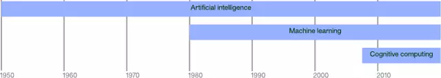

在人工智能和机器学习研究的基础之上，深度学习在 2000 年左右应运而生。计算机科学家在多层神经网络之中使用了新的拓扑学和学习方法。最终，神经网络的进化成功解决了多个领域的棘手问题。

在过去的十年中，认知计算（Cognitive computing）也出现了，其目标是打造可以学习并与人类自然交互的系统。通过成功地击败 Jeopardy 游戏的世界级选手，IBM Watson 证明了认知计算的价值。

在本文中，我将逐一探索上述的所有领域，并对一些关键算法作出解释。

##### 基础性人工智能

1950 年之前的研究提出了大脑是由电脉冲网络组成的想法，正是脉冲之间的交互产生了人类思想与意识。艾伦·图灵表明一切计算皆是数字，那么，打造一台能够模拟人脑的机器也就并非遥不可及。

上文说过，早期的研究很多是强人工智能，但是也提出了一些基本概念，被机器学习和深度学习沿用至今。

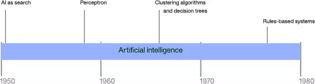

##### 人工智能搜索引擎

人工智能中的很多问题可以通过强力搜索（brute-force search）得到解决。然而，考虑到中等问题的搜索空间，基本搜索很快就受影响。人工智能搜索的最早期例子之一是跳棋程序的开发。亚瑟·塞缪尔（Arthur Samuel）在 IBM 701 电子数据处理机器上打造了第一款跳棋程序，实现了对搜索树（alpha-beta 剪枝）的优化；这个程序也记录并奖励具体行动，允许应用学习每一个玩过的游戏（这是首个自我学习的程序）。为了提升程序的学习率，塞缪尔将其编程为自我游戏，以提升其游戏和学习的能力。

尽管你可以成功地把搜索应用到很多简单问题上，但是当选择的数量增加时，这一方法很快就会失效。以简单的一字棋游戏为例，游戏一开始，有 9 步可能的走棋，每 1 个走棋有 8 个可能的相反走棋，依次类推。一字棋的完整走棋树包含 362,880 个节点。如果你继续将这一想法扩展到国际象棋或者围棋，很快你就会发展搜索的劣势。

##### 感知器

感知器是单层神经网络的一个早期监督学习算法。给定一个输入特征向量，感知器可对输入进行具体分类。通过使用训练集，网络的权重和偏差可为线性分类而更新。感知器的首次实现是 IBM 704，接着在自定义硬件上用于图像识别。

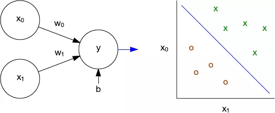

作为一个线性分类器，感知器有能力解决线性分离问题。感知器局限性的典型实例是它无法学习专属的 OR (XOR) 函数。多层感知器解决了这一问题，并为更复杂的算法、网络拓扑学、深度学习奠定了基础。

##### 聚类算法

使用感知器的方法是有监督的。用户提供数据来训练网络，然后在新数据上对该网络进行测试。聚类算法则是一种无监督学习（unsupervised learning）方法。在这种模型中，算法会根据数据的一个或多个属性将一组特征向量组织成聚类。

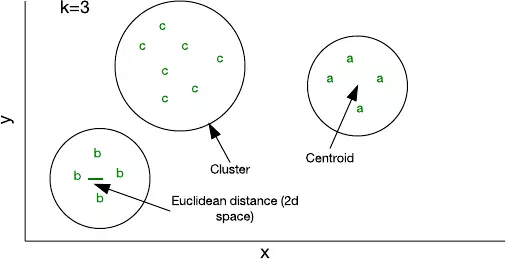

你可以使用少量代码就能实现的最简单的聚类算法是 k-均值（k-means）。其中，k 表示你为样本分配的聚类的数量。你可以使用一个随机特征向量来对一个聚类进行初始化，然后将其它样本添加到其最近邻的聚类（假定每个样本都能表示一个特征向量，并且可以使用 Euclidean distance 来确定「距离」）。随着你往一个聚类添加的样本越来越多，其形心（centroid，即聚类的中心）就会重新计算。然后该算法会重新检查一次样本，以确保它们都在最近邻的聚类中，最后直到没有样本需要改变所属聚类。

尽管 k-均值聚类相对有效，但你必须事先确定 k 的大小。根据数据的不同，其它方法可能会更加有效，比如分层聚类（hierarchical clustering）或基于分布的聚类（distribution-based clustering）。

##### 决策树

决策树和聚类很相近。决策树是一种关于观察（observation）的预测模型，可以得到一些结论。结论在决策树上被表示成树叶，而节点则是观察分叉的决策点。决策树来自决策树学习算法，其中数据集会根据属性值测试（attribute value tests）而被分成不同的子集，这个分割过程被称为递归分区（recursive partitioning）。

考虑下图中的示例。在这个数据集中，我可以基于三个因素观察到某人是否有生产力。使用一个决策树学习算法，我可以通过一个指标来识别属性（其中一个例子是信息增益）。在这个例子中，心情（mood）是生产力的主要影响因素，所以我根据 Good Mood 一项是 Yes 或 No 而对这个数据集进行了分割。但是，在 Yes 这边，还需要我根据其它两个属性再次对该数据集进行切分。表中不同的颜色对应右侧中不同颜色的叶节点。

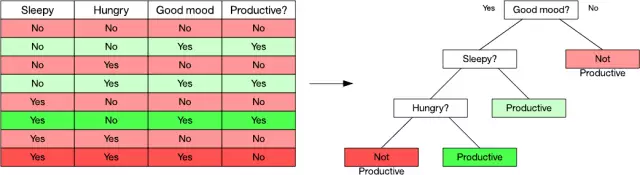

决策树的一个重要性质在于它们的内在的组织能力，这能让你轻松地（图形化地）解释你分类一个项的方式。流行的决策树学习算法包括 C4.5 以及分类与回归树（Classification and Regression Tree）。

##### 基于规则的系统

最早的基于规则和推理的系统是 Dendral，于 1965 年被开发出来，但直到 1970 年代，所谓的专家系统（expert systems）才开始大行其道。基于规则的系统会同时存有所需的知识的规则，并会使用一个推理系统（reasoning system）来得出结论。

基于规则的系统已经在语音识别、规划和控制以及疾病识别等领域得到了应用。上世纪 90 年代人们开发的一个监控和诊断大坝稳定性的系统 Kaleidos 至今仍在使用。

##### 机器学习

机器学习是人工智能和计算机科学的一个子领域，也有统计学和数学优化方面的根基。机器学习涵盖了有监督学习和无监督学习领域的技术，可用于预测、分析和数据挖掘。机器学习不限于深度学习这一种。但在这一节，我会介绍几种使得深度学习变得如此高效的算法。

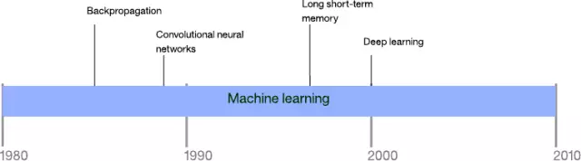

##### 反向传播

神经网络的强大力量源于其多层的结构。单层感知器的训练是很直接的，但得到的网络并不强大。那问题就来了：我们如何训练多层网络呢？这就是反向传播的用武之地。

反向传播是一种用于训练多层神经网络的算法。它的工作过程分为两个阶段。第一阶段是将输入传播通过整个神经网络直到最后一层（称为前馈）。第二阶段，该算法会计算一个误差，然后从最后一层到第一层反向传播该误差（调整权重）。

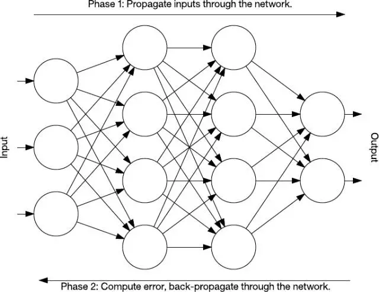

在训练过程中，该网络的中间层会自己进行组织，将输入空间的部分映射到输出空间。反向传播，使用监督学习，可以识别出输入到输出映射的误差，然后可以据此调整权重（使用一个学习率）来矫正这个误差。反向传播现在仍然是神经网络学习的一个重要方面。随着计算资源越来越快、越来越便宜，它还将继续在更大和更密集的网络中得到应用。

##### 卷积神经网络

卷积神经网络（CNN）是受动物视觉皮层启发的多层神经网络。这种架构在包括图像处理的很多应用中都有用。第一个 CNN 是由 Yann LeCun 创建的，当时 CNN 架构主要用于手写字符识别任务，例如读取邮政编码。

LeNet CNN 由好几层能够分别实现特征提取和分类的神经网络组成。图像被分为多个可以被接受的区域，这些子区域进入到一个能够从输入图像提取特征的卷积层。下一步就是池化，这个过程降低了卷积层提取到的特征的维度（通过下采样的方法），同时保留了最重要的信息（通常通过最大池化的方法）。然后这个算法又执行另一次卷积和池化，池化之后便进入一个全连接的多层感知器。卷积神经网络的最终输出是一组能够识别图像特征的节点（在这个例子中，每个被识别的数字都是一个节点）。使用者可以通过反向传播的方法来训练网络。

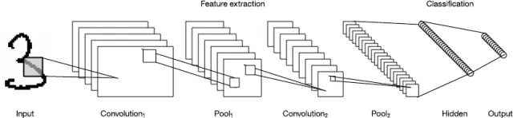

对深层处理、卷积、池化以及全连接分类层的使用打开了神经网络的各种新型应用的大门。除了图像处理之外，卷积神经网络已经被成功地应用在了视频识别以及自然语言处理等多种任务中。卷积神经网络也已经在 GPU 上被有效地实现，这极大地提升了卷积神经网络的性能。

##### 长短期记忆（LSTM）

记得前面反向传播中的讨论吗？网络是前馈式的训练的。在这种架构中，我们将输入送到网络并且通过隐藏层将它们向前传播到输出层。但是，还存在其他的拓扑结构。我在这里要研究的一个架构允许节点之间形成直接的回路。这些神经网络被称为循环神经网络（RNN），它们可以向前面的层或者同一层的后续节点馈送内容。这一特性使得这些网络对时序数据而言是理想化的。

在 1997 年，一种叫做长短期记忆（LSTM）的特殊的循环网络被发明了。LSTM 包含网络中能够长时间或者短时间记忆数值的记忆单元。

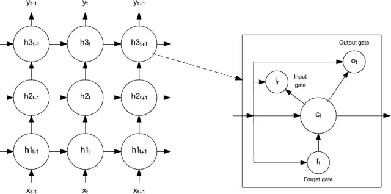

记忆单元包含了能够控制信息流入或者流出该单元的一些门。输入门（input gate）控制什么时候新的信息可以流入记忆单元。遗忘门（forget gate）控制一段信息在记忆单元中存留的时间。最后，输出门（output gate）控制输出何时使用记忆单元中包含的信息。记忆单元还包括控制每一个门的权重。训练算法（通常是通过时间的反向传播（backpropagation-through-time），反向传播算法的一种变体）基于所得到的误差来优化这些权重。

LSTM 已经被应用在语音识别、手写识别、语音合成、图像描述等各种任务中。下面我还会谈到 LSTM。

##### 深度学习

深度学习是一组相对新颖的方法集合，它们从根本上改变了机器学习。深度学习本身不是一种算法，但是它是一系列可以用无监督学习实现深度网络的算法。这些网络是非常深层的，所以需要新的计算方法来构建它们，例如 GPU，除此之外还有计算机集群。

本文目前已经介绍了两种深度学习的算法：卷积神经网络和长短期记忆网络。这些算法已经被结合起来实现了一些令人惊讶的智能任务。如下图所示，卷积神经网络和长短期记忆已经被用来识别并用自然语言描述图片或者视频中的物体。

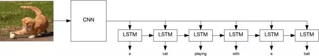

深度学习算法也已经被用在了人脸识别中，也能够以 96% 的准确率来识别结核病，还被用在自动驾驶和其他复杂的问题中。

然而，尽管运用深度学习算法有着很多结果，但是仍然存在问题需要我们去解决。一个最近的将深度学习用于皮肤癌检测的应用发现，这个算法比经过认证的皮肤科医生具有更高的准确率。但是，医生可以列举出导致其诊断结果的因素，却没有办法知道深度学习程序在分类的时候所用的因素。这被称为深度学习的黑箱问题。

另一个被称为 Deep Patient 的应用，在提供病人的病例时能够成功地预测疾病。该应用被证明在疾病预测方面比医生还做得好——即使是众所周知的难以预测的精神分裂症。所以，即便模型效果良好，也没人能够深入到这些大型神经网络去找到原因。

##### 认知计算

人工智能和机器学习充满了生物启示的案例。尽管早期的人工智能专注于建立模仿人脑的机器这一宏伟目标，而现在，是认知计算正在朝着这个目标迈进。

认知计算建立在神经网络和深度学习之上，运用认知科学中的知识来构建能够模拟人类思维过程的系统。然而，认知计算覆盖了好多学科，例如机器学习、自然语言处理、视觉以及人机交互，而不仅仅是聚焦于某个单独的技术。

认知学习的一个例子就是 IBM 的 Waston，它在 Jeopardy 上展示了当时最先进的问答交互。IBM 已经将其扩展在了一系列的 web 服务上了。这些服务提供了用于一些列应用的编程接口来构建强大的虚拟代理，这些接口有：视觉识别、语音文本转换（语音识别）、文本语音转换（语音合成）、语言理解和翻译、以及对话引擎。

##### 继续前进

本文仅仅涵盖了关于人工智能历史以及最新的神经网络和深度学习方法的一小部分。尽管人工智能和机器学习经历了很多起起伏伏，但是像深度学习和认知计算这样的新方法已经明显地提升了这些学科的水平。虽然可能还无法实现一个具有意识的机器，但是今天确实有着能够改善人类生活的人工智能系统。

## 9. 深度学习的难点

深度学习的核心问题就是一个非常难的优化问题。所以在神经网络引入后的几十年间，深度神经网络的优化问题的困难性是阻碍它们成为主流的一个重要因素。并导致了它们在20世纪90年代到21世纪初期间的衰落。不过现在已经基本解决了这个问题。

在本篇博文中，我会探讨优化神经网络的“困难性”，以及理论上是怎么解释这个问题的。简而言之：神经网络变得越深，优化问题就会变得越难。

最简单的神经网络是单节点感知器，其优化问题是凸问题。凸优化问题的好处是所有的局部最小值也是全局最小值。存在各种各样的优化算法来解决凸优化问题，并且每隔几年就会发现更好的用于凸优化的多项式时间的算法。使用凸优化算法可以轻松地优化单个神经元的权重（参见下图）。下面让我们看看扩展一个单神经元后会发生什么。

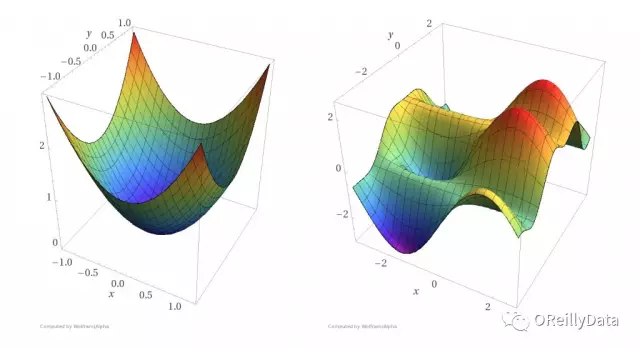  
图1 左图：一个凸函数。右图：一个非凸函数。凸函数比非凸函数更容易找到函数曲面的底部。

下一步自然就是在保持单层神经网络的情况下添加更多的神经元。对于单层n节点感知器的神经网络，如果存在边权重可以使得神经网络能正确地对训练集进行分类，那么这样的边权重是可以通过线性规划在多项式时间O(n)内找到。线性规划也是凸优化的一种特殊情况。这时一个问题应运而生：我们可以对更深的多层神经网络做出这种类似的保证么？不幸的是，不能。

为了可证明地解决两层或多层的一般神经网络的优化问题，需要的算法将会遇到某些计算机科学中最大的未解问题。因此我们对机器学习研究人员尝试找到可证明地解决深度神经网络优化问题的算法不抱有太大的希望。因为这个优化问题是NP-hard问题，这意味着如果在多项式时间内可证明地解决这个问题，那么也可以解决那些几十年来尚未被解决的成千上万的问题。事实上，J. Stephen Judd在1988年就发现下面这个问题是NP-hard问题：

给定一个一般的神经网络和一组训练样本，是否存在一组网络边权重使得神经网络能为所有的训练样本产生正确的输出？

Judd的研究还表明：即使要求一个神经网络只为三分之二的训练样本产生正确的输出仍然是一个NP-hard问题。这意味着即使在最坏的情况下，近似训练一个神经网络在本质上还是困难的。1993年Blum和Rivest发现的事实更糟：即使一个只有两层和三个节点的简单神经网络的训练优化问题仍然是NP-hard问题。

理论上，深度学习与机器学习中的很多相对简单的模型（例如支持向量机和逻辑回归模型）的区别在于，这些简单模型可以数学证明地在多项式时间内完成模型优化。对于这些相对简单的模型，我们可以保证即使用运行时间比多项式时间更长的优化算法也都不能找到更好的模型。但是现有的深度神经网络的优化算法并不能提供这样的保证。在你训练完一个深度神经网络模型之后，你并不知道这个网络模型是否是在你的当前配置下能找到的最优的一个模型。所以你会存有疑虑，如果继续训练模型的话是否可以得到一个更好的模型。

幸运的是我们在实践中可以非常高效地接近这些最优结果：通过运行经典的梯度下降优化方法就可以得到足够好的局部最小值，从而可以使我们在许多常见问题上取得巨大进步，例如图像识别、语音识别和机器翻译。我们简单地忽略最优结果，并在时间允许的情况下尽可能多地进行梯度下降迭代。

似乎传统的优化理论结果是残酷的，但我们可以通过工程方法和数学技巧来尽量规避这些问题，例如启发式方法、增加更多的机器和使用新的硬件（如GPU）。一些研究工作正在积极地探索为什么理论结果很残酷，但这些经典的优化算法却工作得这么好。

深度学习能成功的因素远远不只克服优化问题。神经网络的架构、训练数据的数量、损失函数和正则化等都对于能在机器学习任务中获得高质量的结果起着关键作用。
