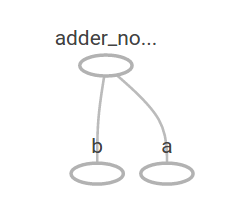

# TensorFlow
## About Tensorflow
TensorFlow™ is an open source software library for numerical computation using data flow graphs. Nodes in the graph represent mathematical operations, while the graph edges represent the multidimensional data arrays (tensors) communicated between them. The flexible architecture allows you to deploy computation to one or more CPUs or GPUs in a desktop, server, or mobile device with a single API. TensorFlow was originally developed by researchers and engineers working on the Google Brain Team within Google's Machine Intelligence research organization for the purposes of conducting machine learning and deep neural networks research, but the system is general enough to be applicable in a wide variety of other domains as well.

## Getting Started
### Getting Started With TensorFlow
 A high-level API like tf.contrib.learn helps you manage data sets, estimators, training and inference. 
 
 This guide begins with a tutorial on TensorFlow Core. Later, we demonstrate how to implement the same model in tf.contrib.learn.
 
#### Tensors

The central unit of data in TensorFlow is the tensor. A tensor consists of a set of primitive values shaped into an array of any number of dimensions. A tensor's rank is its number of dimensions. Here are some examples of tensors:

```
3 # a rank 0 tensor; this is a scalar with shape []
[1. ,2., 3.] # a rank 1 tensor; this is a vector with shape [3]
[[1., 2., 3.], [4., 5., 6.]] # a rank 2 tensor; a matrix with shape [2, 3]
[[[1., 2., 3.]], [[7., 8., 9.]]] # a rank 3 tensor with shape [2, 1, 3]
```

#### TensorFlow Core tutorial

##### Importing TensorFlow

The canonical import statement for TensorFlow programs is as follows:

```
import tensorflow as tf
```

This gives Python access to all of TensorFlow's classes, methods, and symbols. Most of the documentation assumes you have already done this.

##### The Computational Graph

You might think of TensorFlow Core programs as consisting of two discrete sections:

1. Building the computational graph.
2. Running the computational graph.

A computational graph is a series of TensorFlow operations arranged into a graph of nodes. 

Let's build a simple computational graph. Each node takes zero or more tensors as inputs and produces a tensor as an output.

One type of node is a constant. Like all TensorFlow constants, it takes no inputs, and it outputs a value it stores internally. We can create two floating point Tensors node1 and node2 as follows:

```
node1 = tf.constant(3.0, tf.float32)
node2 = tf.constant(4.0) # also tf.float32 implicitly
print(node1, node2)
```

The final print statement produces:
```
Tensor("Const:0", shape=(), dtype=float32) Tensor("Const_1:0", shape=(), dtype=float32)
```

Notice that printing the nodes does not output the values 3.0 and 4.0 as you might expect. Instead, they are nodes that, when evaluated, would produce 3.0 and 4.0, respectively. 

To actually evaluate the nodes, we must run the computational graph within a session.  A session encapsulates the control and state of the TensorFlow runtime.

The following code creates a Session object and then invokes its run method to run enough of the computational graph to evaluate node1 and node2. By running the computational graph in a session as follows:

```
sess = tf.Session()
print(sess.run([node1, node2]))
```

we see the expected values of 3.0 and 4.0:

```
[3.0, 4.0]
```

We can build more complicated computations by combining Tensor nodes with operations (Operations are also nodes.).

For example, we can add our two constant nodes and produce a new graph as follows:

```
node3 = tf.add(node1, node2)
print("node3:", node3)
print("sess.run(node3):", sess.run(node3))
```

The last two print statements produce

```
node3: Tensor("Add:0", shape=(), dtype=float32)
sess.run(node3): 7.0
```

TensorFlow provides a utility called TensorBoard that can display a picture of the computational graph. Here is a screenshot showing how TensorBoard visualizes the graph:


As it stands, this graph is not especially interesting because it always produces a constant result. A graph can be parameterized to accept external inputs, known as **placeholders**. A **placeholder** is a promise to provide a value later.

```
a = tf.placeholder(tf.float32)
b = tf.placeholder(tf.float32)
adder_node = a + b  # + provides a shortcut for tf.add(a, b)
```

The preceding three lines are a bit like a function or a lambda in which we define two input parameters (a and b) and then an operation on them.

We can evaluate this graph with multiple inputs by using the feed_dict parameter to specify Tensors that provide concrete values to these placeholders:

```
print(sess.run(adder_node, {a: 3, b:4.5}))
print(sess.run(adder_node, {a: [1,3], b: [2, 4]}))
```

resulting in the output

```
7.5
[ 3.  7.]
```

In TensorBoard, the graph looks like this:



We can make the computational graph more complex by adding another operation. For example,

```
add_and_triple = adder_node * 3
print(sess.run(add_and_triple, {a: 3, b: 4.5}))
```

produces the output

```
22.5
```

The preceding computational graph would look as follows in TensorBoard:


In machine learning we will typically want a model that can take arbitrary inputs, such as the one above. To make the model trainable, we need to be able to modify the graph to get new outputs with the same input.

**Variables** allow us to add trainable parameters to a graph. They are constructed with a type and initial value:

```python
W = tf.Variable([.3], tf.float32)
b = tf.Variable([-.3], tf.float32)
x = tf.placeholder(tf.float32)
linear_model = W * x + b
```

Constants are initialized when you call tf.constant, and their value can never change. By contrast, variables are not initialized when you call tf.Variable. To initialize all the variables in a TensorFlow program, you must explicitly call a special operation as follows:

```python
init = tf.global_variables_initializer()
sess.run(init)
```

It is important to realize init is a handle to the TensorFlow sub-graph that initializes all the global variables. Until we call `sess.run`, the variables are uninitialized.

Since x is a placeholder, we can evaluate linear_model for several values of x simultaneously as follows:

```
print(sess.run(linear_model, {x: [1, 2, 3, 4]}))
```

to produce the output

```
[ 0.          0.30000001  0.60000002  0.90000004]
```

We've created a model, but we don't know how good it is yet. To evaluate the model on training data, we need a y placeholder to provide the desired values, and we need to write a loss function.

A loss function measures how far apart the current model is from the provided data.

We'll use a standard loss model for linear regression, which sums the squares of the deltas between the current model and the provided data.

 `linear_model - y` creates a vector where each element is the corresponding example's error delta. We call `tf.square` to square that error. Then, we sum all the squared errors to create a single scalar that abstracts the error of all examples using `tf.reduce_sum`:
 
```python
y = tf.placeholder(tf.float32)
squared_deltas = tf.square(linear_model - y)
loss = tf.reduce_sum(squared_deltas)
print(sess.run(loss, {x: [1, 2, 3, 4], y: [0, -1, -2, -3]}))
```

producing the loss value

```python
23.66
```

We could improve this manually by reassigning the values of `W` and `b` to the perfect values of -1 and 1. A variable is initialized to the value provided to `tf.Variable` but can be changed using operations like `tf.assign`. For example, `W=-1` and `b=1` are the optimal parameters for our model. We can change `W` and `b` accordingly:

```python
fixW = tf.assign(W, [-1.])
fixb = tf.assign(b, [1.])
sess.run([fixW, fixb])
print(sess.run(loss, {x: [1, 2, 3, 4], y: [0, -1, -2, -3]}))
```

The final print shows the loss now is zero.

```python
0
```

We guessed the "perfect" values of `W` and `b`, but the whole point of machine learning is to find the correct model parameters automatically. We will show how to accomplish this in the next section.

##### tf.train API

A complete discussion of machine learning is out of the scope of this tutorial. However, TensorFlow provides optimizers that slowly change each variable in order to minimize the loss function. The simplest optimizer is gradient descent. It modifies each variable according to the magnitude of the derivative of loss with respect to that variable. In general, computing symbolic derivatives manually is tedious and error-prone. Consequently, TensorFlow can automatically produce derivatives given only a description of the model using the function tf.gradients. For simplicity, optimizers typically do this for you. For example,

```python
optimizer = tf.train.GradientDescentOptimizer(0.01)
train = optimizer.minimize(loss)
```

```python
sess.run(init) # reset values to incorrect defaults.
for i in range(1000):
    sess.run(train, {x: [1, 2, 3, 4], y: [0, -1, -2, -3]})
print(sess.run([W, b]))
```

results in the final model parameters:

```python
[array([-0.9999969], dtype=float32), array([ 0.99999082], dtype=float32)]
```

##### Complete program

The completed trainable linear regression model is shown here:

```python
import numpy as np
import tensorflow as tf

# Model parameters
W = tf.Variable([.3], tf.float32)
b = tf.Variable([-.3], tf.float32)

# Model input and output
x = tf.placeholder(tf.float32)
linear_model = W * x + b
y = tf.placeholder(tf.float32)

# loss
loss = tf.reduce_sum(tf.square(linear_model - y)) # sum of the squares

# optimizer
optimizer = tf.train.GradientDescentOptimizer(0.01)
train = optimizer.minimize(loss)

# training data
x_train = [1, 2, 3, 4]
y_train = [0, -1, -2, -3]

# training loop
init = tf.global_variables_initializer()
sess = tf.Session()
sess.run(init) # reset values to wrong
for i in range(1000):
    sess.run(train, {x: x_train, y: y_train})
    
# evaluate training accuracy
curr_W, curr_b, curr_loss = sess.run([W, b, loss], {x: x_train, y: y_train})
print("W: %s b: %s loss: %s" % (curr_W, curr_b, curr_loss))
```

When run, it produces

```python
W: [-0.9999969] b: [ 0.99999082] loss: 5.69997e-11
```

This more complicated program can still be visualized in TensorBoard


##### tf.contrib.learn

`tf.contrib.learn` is a high-level TensorFlow library that simplifies the mechanics of machine learning, including the following:

- running training loops
- running evaluation loops
- managing data sets
- managing feeding

`tf.contrib.learn` defines many common models.

Basic usage

Notice how much simpler the linear regression program becomes with `tf.contrib.learn`:

```python
import tensorflow as tf
# Numpy as often used to load, manipulate and preprocess data.
import numpy as np

# Declare list of features. We only have one real-valued feature. There are many
# other types of columns that are more complicated and useful.
features = [tf.contrib.layers.real_valued_column("x", dimension=1)]

# An estimator is the front end to invoke training (fitting) and evaluation
# (inference). There are many predefined types like linear regression,
# logistic regression, linear classification, logistic classification, and
# many neural network classifiers and regressors. The following code
# provides an estimator that does linear regression.
estimator = tf.contrib.learn.LinearRegressor(feature_columns=features)

# TensorFlow provides many helper methods to read and set up data sets.
# Here we use `numpy_input_fn`. We have to tell the function how many batches
# of data (num_epochs) we want and how big each batch should be.
x = np.array([1., 2., 3., 4.])
y = np.array([0., -1., -2., -3.])
input_fn = tf.contrib.learn.io.numpy_input_fn({"x": x}, y, batch_size=4, num_epochs=1000)

# We can invoke 1000 training steps by invoking the `fit` method and passing the
# training data set.
estimator.fit(input_fn=input_fn, steps=1000)

# Here we evaluate how well our model did. In a real example, we would want
# to use a separate validation and testing data set to avoid overfitting.
print(estimator.evaluate(input_fn=input_fn))
```

When run, it produces

```python
{'global_step': 1000, 'loss': 6.3952038e-10}
```

A custom model

`tf.contrib.learn`does not lock you into its predefined models. Suppose we wanted to create a custom model that is not built into TensorFlow. We can still retain the high level abstraction of data set, feeding, training, etc. of `tf.contrib.learn`. For illustration, we will show how to implement our own equivalent model to LinearRegressor using our knowledge of the lower level TensorFlow API.

To define a custom model that works with `tf.contrib.learn`, we need to use `tf.contrib.learn.Estimator`. `tf.contrib.learn.LinearRegressor` is actually a sub-class of `tf.contrib.learn.Estimator`. Instead of sub-classing Estimator, we simply provide Estimator a function `model_fn` that tells `tf.contrib.learn` how it can evaluate predictions, training steps, and loss. The code is as follows:

```python
import numpy as np
import tensorflow as tf
# Declare list of features, we only have one real-valued feature
def model(features, labels, mode):
    # Build a linear model and predict values
    W = tf.get_variable("W", [1], dtype=tf.float64)
    b = tf.get_variable("b", [1], dtype=tf.float64)
    y = W * features['x'] + b
    # Loss sub-graph
    loss = tf.reduce_sum(tf.square(y - labels))
    # Traing sub-graph
    global_step = tf.train.get_global_step()
    optimizer = tf.train.GradientDescentOptimizer(0.01)
    train = tf.group(optimizer.minimize(loss), tf.assign_add(global_step, 1))
    # ModelFnOps connects subgraphs we built to the
    # appropriate functionality
    return tf.contrib.learn.ModelFnOps(mode=mode, predictions=y, loss=loss, train_op=train)

estimator = tf.contrib.learn.Estimator(model_fn=model)

# define our data set
x = np.array([1., 2., 3., 4.])
y = np.array([0., -1., -2., -3.])
input_fn = tf.contrib.learn.io.numpy_input_fn({"x": x}, y, 4, num_epochs=1000)

# train
estimator.fit(input_fn=input_fn, steps=1000)
# evaluate our model
print(estimator.evaluate(input_fn=input_fn, steps=10))
```

When run, it produces

```python
{'global_step': 1000, 'loss': 1.4208121e-10}
```

Notice how the contents of the custom `model()` function are very similar to our manual model training loop from the lower level API.

---

### MNIST For ML Beginners

When one learns how to program, there's a tradition that the first thing you do is print "Hello World." Just like programming has Hello World, machine learning has MNIST.

MNIST is a simple computer vision dataset. It consists of images of handwritten digits like these:


It also includes labels for each image, telling us which digit it is. For example, the labels for the above images are 5, 0, 4, and 1.

In this tutorial, we're going to train a model to look at images and predict what digits they are. Our goal isn't to train a really elaborate model that achieves state-of-the-art performance -- although we'll give you code to do that later! -- but rather to dip a toe into using TensorFlow. As such, we're going to start with a very simple model, called a Softmax Regression.

The actual code for this tutorial is very short, and all the interesting stuff happens in just three lines. However, it is very important to understand the ideas behind it: both how TensorFlow works and the core machine learning concepts. Because of this, we are going to very carefully work through the code.

#### About this tutorial

This tutorial is an explanation, line by line, of what is happening in the [mnist_softmax.py](https://github.com/tensorflow/tensorflow/blob/r1.1/tensorflow/examples/tutorials/mnist/mnist_softmax.py) code.

What we will accomplish in this tutorial:

- Learn about the MNIST data and softmax regressions
- Create a function that is a model for recognizing digits, based on looking at every pixel in the image
- Use TensorFlow to train the model to recognize digits by having it "look" at thousands of examples (and run our first TensorFlow session to do so)
- Check the model's accuracy with our test data

#### The MNIST Data

The MNIST data is hosted on Yann LeCun's website. If you are copying and pasting in the code from this tutorial, start here with these two lines of code which will download and read in the data automatically:

```python
from tensorflow.examples.tutorials.mnist import input_data
mnist = input_data.read_data_sets("MNIST_data/", one_hot=True)
```

The MNIST data is split into three parts: 55,000 data points of training data (`mnist.train`), 10,000 points of test data (`mnist.test`), and 5,000 points of validation data (`mnist.validation`). 

This split is very important: it's essential in machine learning that we have separate data which we don't learn from so that we can make sure that what we've learned actually generalizes!

As mentioned earlier, every MNIST data point has two parts: an image of a handwritten digit and a corresponding label. We'll call the images "x" and the labels "y". Both the training set and test set contain images and their corresponding labels; for example the training images are `mnist.train.images` and the training labels are `mnist.train.labels`.

Each image is 28 pixels by 28 pixels. We can interpret this as a big array of numbers:


We can flatten this array into a vector of 28x28 = 784 numbers. It doesn't matter how we flatten the array, as long as we're consistent between images.

Flattening the data throws away information about the 2D structure of the image. Isn't that bad? Well, the best computer vision methods do exploit this structure, and we will in later tutorials. But the simple method we will be using here, a softmax regression (defined below), won't.

The result is that `mnist.train.images` is a tensor (an n-dimensional array) with a shape of `[55000, 784]`. The first dimension is an index into the list of images and the second dimension is the index for each pixel in each image. Each entry in the tensor is a pixel intensity between 0 and 1, for a particular pixel in a particular image.


Each image in MNIST has a corresponding label, a number between 0 and 9 representing the digit drawn in the image.

For the purposes of this tutorial, we're going to want our labels as "one-hot vectors". A one-hot vector is a vector which is 0 in most dimensions, and 1 in a single dimension. In this case, the nth digit will be represented as a vector which is 1 in the nth dimension. For example, 3 would be [0,0,0,1,0,0,0,0,0,0]. Consequently, mnist.train.labels is a [55000, 10] array of floats.


#### Softmax Regressions

We know that every image in MNIST is of a handwritten digit between zero and nine. So there are only ten possible things that a given image can be. We want to be able to look at an image and give the probabilities for it being each digit. For example, our model might look at a picture of a nine and be 80% sure it's a nine, but give a 5% chance to it being an eight (because of the top loop) and a bit of probability to all the others because it isn't 100% sure.

This is a classic case where a softmax regression is a natural, simple model. If you want to assign probabilities to an object being one of several different things, softmax is the thing to do, because softmax gives us a list of values between 0 and 1 that add up to 1. Even later on, when we train more sophisticated models, the final step will be a layer of softmax.

A softmax regression has two steps: first we add up the evidence of our input being in certain classes, and then we convert that evidence into probabilities.

To tally up the evidence that a given image is in a particular class, we do a weighted sum of the pixel intensities. The weight is negative if that pixel having a high intensity is evidence against the image being in that class, and positive if it is evidence in favor.

The following diagram shows the weights one model learned for each of these classes. Red represents negative weights, while blue represents positive weights.


 
You can picture our softmax regression as looking something like the following, although with a lot more xs. For each output, we compute a weighted sum of the xs, add a bias, and then apply softmax.


If we write that out as equations, we get:


We can "vectorize" this procedure, turning it into a matrix multiplication and vector addition. This is helpful for computational efficiency. (It's also a useful way to think.)


More compactly, we can just write:

$$ y = softmax(Wx+b)$$

Now let's turn that into something that TensorFlow can use.

#### Implementing the Regression

TensorFlow also does its heavy lifting outside Python, but it takes things a step further to avoid this overhead. Instead of running a single expensive operation independently from Python, TensorFlow lets us describe a graph of interacting operations that run entirely outside Python. (Approaches like this can be seen in a few machine learning libraries.)

To use TensorFlow, first we need to import it.

```python
import tensorflow as tf
```

We describe these interacting operations by manipulating symbolic variables. Let's create one:

```python
x = tf.placeholder(tf.float 32, [None, 784])
```

`x` isn't a specific value. It's a `placeholder`, a value that we'll input when we ask TensorFlow to run a computation. We want to be able to input any number of MNIST images, each flattened into a 784-dimensional vector. We represent this as a 2-D tensor of floating-point numbers, with a shape [None, 784]. (Here None means that a dimension can be of any length.)

We also need the weights and biases for our model. We could imagine treating these like additional inputs, but TensorFlow has an even better way to handle it: `Variable`. A `Variable` is a modifiable tensor that lives in TensorFlow's graph of interacting operations. It can be used and even modified by the computation. For machine learning applications, one generally has the model parameters be Variables.

```python
W = tf.Variable(tf.zeros([784, 10]))
b = tf.Variable(tf.zeros([10]))
```

We create these `Variables` by giving `tf.Variable` the initial value of the `Variable`: in this case, we initialize both `W` and `b` as tensors full of zeros. Since we are going to learn `W` and `b`, it doesn't matter very much what they initially are.

Notice that W has a shape of [784, 10] because we want to multiply the 784-dimensional image vectors by it to produce 10-dimensional vectors of evidence for the difference classes. b has a shape of [10] so we can add it to the output.

We can now implement our model. It only takes one line to define it!

```python
y = tf.nn.softmax(tf.matmul(x, W) + b)
```

First, we multiply x by W with the expression tf.matmul(x, W). This is flipped from when we multiplied them in our equation, where we had Wx, as a small trick to deal with x being a 2D tensor with multiple inputs. We then add b, and finally apply tf.nn.softmax.

That's it. It only took us one line to define our model, after a couple short lines of setup. That isn't because TensorFlow is designed to make a softmax regression particularly easy: it's just a very flexible way to describe many kinds of numerical computations, from machine learning models to physics simulations. And once defined, our model can be run on different devices: your computer's CPU, GPUs, and even phones!

#### Training

In order to train our model, we need to define what it means for the model to be good. Well, actually, in machine learning we typically define what it means for a model to be bad. We call this the cost, or the loss, and it represents how far off our model is from our desired outcome. We try to minimize that error, and the smaller the error margin, the better our model is.

One very common, very nice function to determine the loss of a model is called "cross-entropy." Cross-entropy arises from thinking about information compressing codes in information theory but it winds up being an important idea in lots of areas, from gambling to machine learning. It's defined as:

$$H_{y'}(y)=-\sum_{i}y'_{i}\log(y_{i}) $$

Where y is our predicted probability distribution, and y′ is the true distribution (the one-hot vector with the digit labels). In some rough sense, the cross-entropy is measuring how inefficient our predictions are for describing the truth. 

To implement cross-entropy we need to first add a new placeholder to input the correct answers:

```python
y_ = tf.placeholder(tf.float32, [None, 10])
```

Then we can implement the cross-entropy function,

```python
cross_entropy = tf.reduce_mean(-tf.reduce_sum(y_ * tf.log(y), reduction_indices=[1]))
```

First, `tf.log` computes the logarithm of each element of y. Next, we multiply each element of y_ with the corresponding element of `tf.log(y)`. Then `tf.reduce_sum` adds the elements in the second dimension of y, due to the `reduction_indices=[1]` parameter. Finally,` tf.reduce_mean` computes the mean over all the examples in the batch.

Note that in the source code, we don't use this formulation, because it is numerically unstable. Instead, we apply `tf.nn.softmax_cross_entropy_with_logits` on the unnormalized logits (e.g., we call `softmax_cross_entropy_with_logits` on `tf.matmul(x, W) + b)`, because this more numerically stable function internally computes the softmax activation. In your code, consider using `tf.nn.softmax_cross_entropy_with_logits` instead.

Now that we know what we want our model to do, it's very easy to have TensorFlow train it to do so. Because TensorFlow knows the entire graph of your computations, it can automatically use the backpropagation algorithm to efficiently determine how your variables affect the loss you ask it to minimize. Then it can apply your choice of optimization algorithm to modify the variables and reduce the loss.

```python
train_step = tf.train.GradientDescentOptimizer(0.5).minimize(cross_entropy)
```

In this case, we ask TensorFlow to minimize `cross_entropy` using the gradient descent algorithm with a learning rate of 0.5. Gradient descent is a simple procedure, where TensorFlow simply shifts each variable a little bit in the direction that reduces the cost. But TensorFlow also provides many other optimization algorithms: using one is as simple as tweaking one line.

What TensorFlow actually does here, behind the scenes, is to add new operations to your graph which implement backpropagation and gradient descent. Then it gives you back a single operation which, when run, does a step of gradient descent training, slightly tweaking your variables to reduce the loss.

We can now launch the model in an `InteractiveSession`:

```python
sess = tf.InteractiveSession()
```

We first have to create an operation to initialize the variables we created:

```python
tf.global_variables_initializer().run()
```

Let's train -- we'll run the training step 1000 times!

```python
for _ in range(1000):
    batch_xs, batch_ys = mnist.train.next_batch(100)
    sess.run(train_step, feed_dict={x: batch_xs, y_: batch_ys})
```

Each step of the loop, we get a "batch" of one hundred random data points from our training set. We run train_step feeding in the batches data to replace the `placeholder`s.

Using small batches of random data is called stochastic training -- in this case, stochastic gradient descent. Ideally, we'd like to use all our data for every step of training because that would give us a better sense of what we should be doing, but that's expensive. So, instead, we use a different subset every time. Doing this is cheap and has much of the same benefit.

##### Evaluating Our Model

Well, first let's figure out where we predicted the correct label. `tf.argmax` is an extremely useful function which gives you the index of the highest entry in a tensor along some axis. For example, `tf.argmax(y,1)` is the label our model thinks is most likely for each input, while `tf.argmax(y_,1)` is the correct label. We can use `tf.equal` to check if our prediction matches the truth.

```python
correct_prediction = tf.equal(tf.argmax(y, 1), tf.argmax(y_, 1))
```

That gives us a list of booleans. To determine what fraction are correct, we cast to floating point numbers and then take the mean. For example, [True, False, True, True] would become [1,0,1,1] which would become 0.75.

```python
accuracy = tf.reduce_mean(tf.cast(correct_prediction, tf.float32))
```

Finally, we ask for our accuracy on our test data.

```python
print(sess.run(accuracy, feed_dict={x: mnist.test.images, y_: mnist.test.labels}))
```

This should be about 92%.

---

### Deep MNIST for Experts