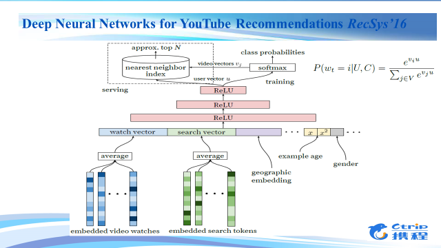

# 深度学习与推荐系统

## 1. 深度学习在推荐系统中的应用

近些年，深度学习在自然语言处理、语义识别等领域都取得了非常大的成就。相对来说，深度学习在推荐系统领域还是处于一个早期的探索阶段。

什么是推荐系统呢？它的主要功能是帮助用户找到符合他需求的个性化的商品。一方面，它可以在如今信息爆炸的时代高效的检索商品，另一方面，它可以快速的帮助用户找到相应的商品，有向导和咨询的功能。

推荐系统会评估用户和商品之间的相关性，会产生用户与商品的一个相关性的score，根据这个score我们就可以把排序最高的商品推荐给用户。其实这本质上就是一个个性化排序问题。

那么，根据推荐系统的不同输入，我们可以把它的基本技术分为这样几类。第一类是比较熟悉的、经常使用的协同过滤的技术，它使用的一方面是用户的信息，另一方面是和用户有相似行为的群体的信息，协同过滤技术就是根据这一群体的信息给用户做推荐。第二类技术是基于内容的推荐，它用到的一方面是用户的信息，另一方面是商品的显性相关属性信息，基于内容的推荐就是向用户推荐他可能浏览或者购买过的相似产品的信息。还有一类技术是混合技术，会运用不同的输入和技术共同进行推荐。

接下来简单看一下传统推荐技术的优点和缺点。基于内容的推荐，它的优点是：第一，简单直接；第二，有可解释的结果；第三，可以比较不同产品之间的相似度。它的缺点是对于从来没有过购买行为的用户会有一个冷启动的问题，另外，基于内容的推荐必须要得到关于产品显性的属性信息。相比较之下，协同过滤技术就不需要这些信息，它是根据用户与和用户行为相似的群体的信息来进行推荐的，它的一个优点就是可以给用户推荐出一些新奇的、用户可能没有购买过的商品。它的缺点，首先也是新用户的冷启动问题，然后是因为用户与商品之间的交互数据不够多，有数据稀疏的问题。最后相对于基于内容的推荐技术，协同过滤技术对结果没有那么好的解释性。

接下来我们就可以看看深度学习是如何应用到推荐系统中的。第一个问题就是，为什么需要深度学习？深度学习能给系统带来什么？这里我们通过学习近些年深度学习大牛们在推荐系统上的研究发展，做了一些总结，下边我们将结合具体的文献和应用来看一看，深度学习如何应用到推荐系统中：

###### 1. 通过深度学习我们可以学习隐藏特征

这里有一个简单的RBM模型，有两层，下面一层是可视层，主要是观察输入的数据。上面一层是隐藏层，它主要是根据之前得到的数据学习和生成隐藏的特征，并还原和预测出可视层的数据。这两个层是全连接的，层内是没有连接的。这样我们就可以把它运用到协同过滤的技术中。用户对电影的评分会出现在可视层中，比如他对电影评分为3，那么第列中第三个格子是黑色的，其他没有，以此类推。可视层的单元数目是等于用户评价过的电影的数目，但是隐藏层单元的数目是固定的，它会通过共享用户评价过的电影的权重最终来实现协同过滤。总的来说，通过这样的方法，我们首先可以观测用户对于电影的评分数据，学习出用户抽象的隐藏特征，然后通过这些特征还原生成出可见层的评分数据，最后根据这些数据在缺失数据中的预测结果来形成最终的推荐结果。

###### 2. 通过深度学习我们可以学习多层次的抽象特征表示

上述的RBM还只是一个两层的浅层模型，进一步地，通过多层的RBM，我们可以学习出多层次的特征表示。这也正是深度学习神奇和强大的地方，通过非监督和监督的学习，我们可以将显示的特征学习出表示不同含义的多层次的抽象特征。图上的例子主要是利用深度学习来解决群组推荐的问题。群组推荐是推荐系统的一个细分领域，是给一个固定的群组做推荐，而群组中是有不同的成员的。通常，我们是把这个群组当做一个虚拟的用户，再利用传统的推荐技术进行推荐。但这里有个问题，因为一个群组包含不同的群组成员，在推荐时我们需要平衡不同成员之间的偏好，要去最大化群组成员的效用，在这幅图右侧，首先使用DBN学习出群组成员的偏好，再进而向上抽象分离出用户个性化的偏好（individualfeature），和集体偏好（collective feature）。在左侧，一个双臂的RBM，将群组的偏好以及用户的集体特征作为可见层来进一步地学习出全面的群组特征。这样通过深度学习，我们可以从数据中学习多层次的抽象特征表示。

###### 3. 深度学习使我们能够使用更多的内容信息进行学习并提出抽象出特征，从而来缓解之前提到的推荐系统中冷启动问题

这里的说的内容信息包括两种：一种内容信息是异质的内容信息，举个例子，用户听音乐，不同歌曲的歌手，类型，流派等文字信息，与歌曲中的音频信号信息，他们是异质的。我们人脑通过可以通过听觉欣赏出这首乐曲是抒情的钢琴曲，还是抖腿的电子乐。而现在通过深度学习的技术，我们也可以将异质的内容学习抽象成同质的语义特征。在NIPS 的这篇文章中，他们通过深度的CNN来学习隐语义特征，图中是根据这些歌手歌曲的学习到的隐语义特征进行聚类的可视化结果，我们可以看到，不同的颜色可以很好地表示不同的音乐流派，例如红色的是hip-hop，绿色的是摇滚，黄色的是pop，蓝色的是电子乐。那么当音乐的显性特征缺失时，我们就可以用这种方法找出它的隐性特征，很好的解决推荐时的冷启动问题。

另一种是跨域的内容信息，当一个用户喜欢看恐怖电影时，他有很大可能也喜欢看恐怖小说；当一个用户出行时喜欢坐头等舱，那他就有很大可能也会订高端的酒店。对于一个用户来说，他在不同域上的特征是相通的，但在不同域上的数据，我们无法直接把他们放在一起运用。通过深度学习可以将不同域上的特征进行不断抽象，对不同域上的数据进行同步的学习。图中的例子是多媒体推荐，它使用多个DNN进行跨域的推荐。通过这种方法，我们可以通过共同学习各个域上的数据抽象出用户在不同域上的隐式特征，从而很好的解决了跨域的冷启动问题。

至此，我们简单小结一下为什么需要深度学习？
- 第一，它可以学习出隐藏的特征
- 第二，它可以学习出多层次的特征表示
- 第三，深度学习可以对异质的或者跨域的内容信息进行学习，解决推荐系统常见的冷启动问题。

###### 4. Wide & Deep Learning on high dimensional Sparse Data

从前边的介绍和应用我们可以看到，深度学习具有很强的特征抽象和学习能力，并且能够使我们应用更多的传统推荐系统无法直接使用的跨域和异质的内容信息。随着大数据时代的到来，对于这些数据的使用已经变得更加容易，因此我们可以将越来越多的数据融合使用到我们的推荐系统中。然而深度模型由于它的高复杂度，对于高纬度的特别是超高纬度的稀疏数据存在比较大的问题，假设我们有1000万维的稀疏特征，隐藏层的数目假设只有1000个，那么就会产生100亿个参数，我们可能将会需要万亿个数据才能有效的训练出这些参数。这在很多场景中是不可能得到的，即使有这么多的数据也需要非常大的计算量来学习这些参数。接下来，我们会详细介绍一个能够在高维稀疏数据上深广模型。这里深广模型，深就是深度模型，其实就是DNN，广就是高维稀疏的LR模型。

首先，我们看一下高维稀疏数据上应用的LR模型。其实我们可以把逻辑回归模型看成一个简单的两层的神经网络，下面的神经网络是它输入的高维稀疏的数据，点亮的神经元为1的、被激活的，未点亮的就是为0、没有被激活的，这里高维稀疏数据的一大特点是大部分的输入数据都是为0（未激活）的。LR模型对于高维稀疏的数据有非常好的性能，并且可以通过交叉特征来学习与目标Label之间的关联。主要的缺点是需要人工的去设计交叉特征，同时模型比较简单，无法很好的挖掘用户与产品需求内在的相关性。

对于深度模型，我们首先要解决上述我们说的深度模型在高维数据上的问题，我们首先来看一个叫做因子机的模型，这个模型由Rendle在2010年提出，之后其凭借优秀的性能广泛的被应用于各类数据挖掘的比赛。

它的一个主要的特点是可以学习任意两个离散特征之间的相关性，并且将其高维的稀疏数据映射到一个低维的固定长度的隐式特征向量上。利用这样的思想，我们可以首先将高维稀疏的离散特征数据映射到低维固定长度的实数特征向量上，再将低维的实数向量作为输入放到深度网络中进行更深更复杂的模型进行训练。

明白了高维稀疏数据上的深度模型以及广度模型（LR），那么这里的深广模型就很简单了，它是广度模型和深度模型的一个联合模型，这里的联合模型指的是一个模型，他们的参数是联合训练的。在深广模型中，深度模型可以挖掘用户与产品，以及各个属性之间的隐性的关系，而广度模型可以使用更少的参数高效地记忆特征与目标Label之间的线性关联。

最后，分享一下我们在这个过程中的几点tricks。首先，我们使用了更多的上下文信息和内容信息，这是可以帮助我们解决推荐系统中的冷启动问题的。第二，Dropout可以防止over-fitting，但是它也可能会带来under-fitting，也就是学习的不够。第三，对于深度模型来说，它可以有很好的效果，但并不是越深越好。我们相信随着深度学习技术的不断成熟，它会在推荐系统中变得越来越流行，并成为推荐系统领域中的一项非常重要的技术。

[原文链接](https://ask.hellobi.com/blog/transwarp/4903)

---

## 2. 推荐系统中基于深度学习的混合协同过滤模型

近些年，深度学习在语音识别、图像处理、自然语言处理等领域都取得了很大的突破与成就。相对来说，深度学习在推荐系统领域的研究与应用还处于早期阶段。

本文将分享深度学习在推荐系统上的应用，同时介绍携程基础BI团队在这一领域上的实践。

##### 一、推荐系统介绍

推荐系统的功能是帮助用户主动找到满足其偏好的个性化物品并推荐给用户。推荐系统的输入数据可以多种多样，归纳起来分为用户(User)、物品(Item)和评分(Ratings)三个层面，它们分别对应于一个矩阵中的行、列、值。对于一个特定用户，推荐系统的输出为一个推荐列表，该列表按照偏好得分顺序给出了该用户可能感兴趣的物品。

如上图右边所示，推荐问题一个典型的形式化描述如下：我们拥有一个大型稀疏矩阵，该矩阵的每一行表示一个User，每一列表示一个Item，矩阵中每个“+”号表示该User对Item的Rating，(该分值可以是二值化分值，喜欢与不喜欢；也可以是0~5的分值等)。

现在需要解决的问题是：给定该矩阵之后，对于某一个User，向其推荐那些Rating缺失的Item(对应于矩阵中的“?”号)。

有了如上的形式化描述之后，推荐系统要解决的问题归结为两部分，分别为预测(Prediction)与推荐(Recommendation)。

“预测”要解决的问题是推断每一个User对每一个Item的偏爱程度，“推荐”要解决的问题是根据预测环节所计算的结果向用户推荐他没有打过分的Item。

但目前绝大多数推荐算法都把精力集中在“预测”环节上，“推荐”环节则根据预测环节计算出的得分按照高低排序推荐给用户，本次分享介绍的方案主要也是”预测”评分矩阵R中missing的评分值。

##### 二、基于协同过滤的推荐

基于协同过滤的推荐通过收集用户过去的行为以获得其对物品的显示或隐式信息，根据用户对物品的偏好，发现物品或者用户的相关性，然后基于这些关联性进行推荐。

其主要可以分为两类：分别是memory-based推荐与model-based推荐。其中memory-based推荐主要分为Item-based方法与User-based方法。协同过滤分类见下图。

Memory-based推荐方法通过执行最近邻搜索，把每一个Item或者User看成一个向量，计算其他所有Item或者User与它的相似度。有了Item或者User之间的两两相似度之后，就可以进行预测与推荐了。

Model-based推荐最常见的方法为Matrix factorization，其示意图见图3左边。矩阵分解通过把原始的评分矩阵R分解为两个矩阵相乘，并且只考虑有评分的值，训练时不考虑missing项的值，如图3右边所示。R矩阵分解成为U与V两个矩阵后，评分矩阵R中missing的值就可以通过U矩阵中的某列和V矩阵的某行相乘得到。矩阵分解的目标函数见图3，U矩阵与V矩阵的可以通过梯度下降(gradient descent)算法求得，通过交替更新u与v多次迭代收敛之后可求出U与V。

矩阵分解背后的核心思想，找到两个矩阵，它们相乘之后得到的那个矩阵的值，与评分矩阵R中有值的位置中的值尽可能接近。这样一来，分解出来的两个矩阵相乘就尽可能还原了评分矩阵R，因为有值的地方，值都相差得尽可能地小，那么missing的值通过这样的方式计算得到，比较符合趋势。

协同过滤中主要存在如下两个问题：稀疏性与冷启动问题。已有的方案通常会通过引入多个不同的数据源或者辅助信息(Side information)来解决这些问题，用户的Side information可以是用户的基本个人信息、用户画像信息等，而Item的Side information可以是物品的content信息等。例如文献[1]提出了一个Collective Matrix Factorization(CMF)模型，如图4所示。

CMF模型通过分别分解评分矩阵R，User的side information矩阵，Item的side information矩阵，其中User或者Item出现在多个矩阵中，其所分解的隐向量都是一致的。

##### 三、深度学习在推荐系统中的应用

Model-based方法的目的就是学习到User的隐向量矩阵U与Item的隐向量矩阵V。我们可以通过深度学习来学习这些抽象表示的隐向量。

Autoencoder(AE)是一个无监督学习模型，它利用反向传播算法，让模型的输出等于输入。文献[2]利用AE来预测用户对物品missing的评分值，该模型的输入为评分矩阵R中的一行(User-based)或者一列(Item-based)，其目标函数通过计算输入与输出的损失来优化模型，而R中missing的评分值通过模型的输出来预测，进而为用户做推荐,其模型如图5所示。

Denoising Autoencoder(DAE)是在AE的基础之上，对输入的训练数据加入噪声。所以DAE必须学习去除这些噪声而获得真正的没有被噪声污染过的输入数据。因此，这就迫使编码器去学习输入数据的更加鲁棒的表达，通常DAE的泛化能力比一般的AE强。Stacked Denoising Autoencoder(SDAE)是一个多层的AE组成的神经网络，其前一层自编码器的输出作为其后一层自编码器的输入，如图6所示。

文献[3]在SDAE的基础之上，提出了Bayesian SDAE模型，并利用该模型来学习Item的隐向量，其输入为Item的Side information。该模型假设SDAE中的参数满足高斯分布，同时假设User的隐向量也满足高斯分布，进而利用概率矩阵分解来拟合原始评分矩阵。该模型通过最大后验估计(MAP)得到其要优化的目标函数，进而利用梯度下降学习模型参数，从而得到User与Item对应的隐向量矩阵。其图模型如图7所示。

在已有工作的基础之上，携程基础BI算法团队通过改进现有的深度模型，提出了一种新的混合协同过滤模型，并将其成果投稿与国际人工智能顶级会议AAAI 2017并被接受。该成果通过利用User和Item的评分矩阵R以及对应的Side information来学习User和Item的隐向量矩阵U与V，进而预测出评分矩阵R中missing的值，并为用户做物品推荐。

该成果中提出了一种Additional Stacked Denoising Autoencoder(aSDAE)的深度模型用来学习User和Item的隐向量，该模型的输入为User或者Item的评分值列表，每个隐层都会接受其对应的Side information信息的输入(该模型灵感来自于NLP中的Seq-2-Seq模型，每层都会接受一个输入，我们的模型中每层接受的输入都是一样的，因此最终的输出也尽可能的与输入相等)，其模型图见图8。

结合aSDAE与矩阵分解模型，我们提出了一种混合协同过滤模型，见图9所示。该模型通过两个aSDAE学习User与Item的隐向量，通过两个学习到隐向量的内积去拟合原始评分矩阵R中存在的值，其目标函数由矩阵分解以及两个aSDAE的损失函数组成，可通过stochastic gradient descent(SGD)学习出U与V，详情大家可以阅读我们的paper《A Hybrid Collaborative Filtering Model with Deep Structure for Recommender Systems》[4]。

在今年的推荐系统顶级会议RecSys上，Google利用DNN来做YouTube的视频推荐[5]，其模型图如图11所示。通过对用户观看的视频，搜索的关键字做embedding，然后在串联上用户的side information等信息，作为DNN的输入，利用一个多层的DNN学习出用户的隐向量，然后在其上面加上一层softmax学习出Item的隐向量，进而即可为用户做Top-N的推荐。

此外，文献[6]通过卷积神经网络(CNN)提出了一种卷积矩阵分解，来做文档的推荐，该模型结合了概率矩阵分解(PMF)与CNN模型，图见图12所示。该模型利用CNN来学习Item的隐向量，其对文档的每个词先做embedding，然后拼接所有词组成一个矩阵embedding矩阵，一篇文档即可用一个二维矩阵表示，其中矩阵的行即为文档中词的个数，列即为embedding词向量的长度，然后在该矩阵上做卷积、池化以及映射等，即可得到item的隐向量。User的隐向量和PMF中一样，假设其满足高斯分布，其目标函数由矩阵分解以及CNN的损失函数组成。

##### 四、总结

本文介绍了一些深度学习在推荐领域的应用，我们发现一些常见的深度模型(DNN, AE, CNN等)都可以应用于推荐系统中，但是针对不同领域的推荐，我们需要更多的高效的模型。随着深度学习技术的发展，我们相信深度学习将会成为推荐系统领域中一项非常重要的技术手段。

[1] Ajit P. Singh, Geoffrey J. Gordon. “Relational Learning via Collective Matrix Factorization”, KDD 2008

[2] Suvash Sedhain, Aditya Krishna Menon, Scott Sanner, Lexing Xie. “AutoRec: Autoencoders Meet Collaborative Filtering”, WWW 2015

[3] Hao Wang，Naiyan Wang, Dit-Yan Yeung. “Collaborative Deep Learning for Recommender Systems”, KDD 2015

[4] Xin Dong, Lei Yu, ZhonghuoWu, Yuxia Sun, Lingfeng Yuan, Fangxi Zhang. “A Hybrid Collaborative Filtering Model with Deep Structure for Recommender Systems”, AAAI 2017

[5] Paul Covington, Jay Adams, Emre Sargin. “Deep Neural Networks for YouTube Recommendations”, RecSys 2016

[6] Donghyun Kim, Chanyoung Park, Jinoh Oh, Sungyoung Lee, Hwanjo Yu. “Convolutional Matrix Factorization for Document Context-Aware Recommendation”, RecSys 2016

[原文链接](http://techshow.ctrip.com/archives/1823.html)

---
## 3. YouTube推出基于深度神经网络的推荐系统

YouTube的推荐系统是是世界上规模最大、最复杂的推荐系统之一。

他们最近利用深度神经网络实现YouTube推荐系统。

YouTube的全球用户已经超过十亿，每秒上传的视频长度以小时计。视频“语料”库存日益增长，就需要一个推荐系统及时、准确地将用户感兴趣的视频不断推荐给用户。相比其他商业推荐系统，Youtube推荐系统面临三个主要的挑战：
- 规模。现有绝大多数可行的推荐算法，在处理YouTube级别的海量视频就力不从心了。
- 新鲜度。YouTube视频“语料”库不仅仅是储量巨大，每时每刻上传的新增视频也是源源不断。推荐系统要及时针对用户上传的内容进行分析建模，同时要兼顾已有视频和新上传视频的平衡。
- 噪声。由于用户行为的稀疏性和不可观测的影响因素，用户的历史记录本质上难以预测。

因此YouTube推荐引擎很难获得用户满意度的真实信息，取而代之的是使用带有噪声的反馈信号建模分析。

此外，与视频内容相关的元数据通常结构不良、没有明确定义的本体，这也对推荐算法的鲁棒性很有挑战。

和其他Google产品一样，YouTube推荐系统也将研究重点转移到深度学习，它是基于Google Brain开发的。而Google Brain已经开放源代码，也就是现在风头正旺的TensorFlow。TensorFlow给YouTube推荐系统带来了开发测试上的灵活性，在会议文章中也有体现。

整个模型的深度网络配置大概需要学习十亿个参数，并且使用了数千亿的数据进行训练。

##### 系统概况

YouTube推荐系统主要由两个深度神经网络组成：
- 第一个神经网络用来生成候选视频列表；
- 第二个神经网络用来对输入视频列表打分排名，以便将排名靠前的视频推荐给用户。

候选视频生成是依靠协同过滤算法产生一个宽泛的针对用户的个性化推荐候选名单。排名神经网络是基于第一个候选生成网络的列表，提供更精细的区分细化，从来达到较高的推荐命中率。通过定义目标函数来提供一系列描述视频和用户的特征，排名网络则根据目标函数来给每一个视频打分。分数最高的一组视频就被推荐给用户。

两级推荐系统的好处是可以处理海量（百万量级）视频，且保证推荐给用户的视频是个性化的或者有吸引力的。

此外，这种分级设计可以使用其他来源产生的候选视频，而不必完全依赖于来自第一个神经网络的输出。

推荐系统在开发和训练阶段也和其他深度学习技术一样，采用了各种量化指标，如准确率、覆盖率、排名损耗等等。但是为了最终确定算法或者模型的有效性，Google团队还采用了A/B测试。通过A/B测试，可以衡量例如鼠标点击率、观看时间以及其他量化指标的微妙变化和联系。这一点相当重要，因为很多时候A/B测试跟离线实验并不相关。

##### 候选推荐生成

在候选生成阶段，针对每个用户，上百个相关的视频从YouTube的视频语料库中被选出。推荐过程可以看作是基于排名损失的矩阵分解。Youtube推荐系统早期的迭代是使用浅神经网路，根据用户观看记录，模仿矩阵分解的过程。

现在的手段则可以看作是矩阵分解的非线性实现。

实际上目前很常用的基于协同过滤的推荐算法，本质上就是针对高维度的输入数据进行矩阵分解。而YouTube推荐系统中的候选推荐生成网络，恰好高效准确的模拟出矩阵分解的非线性实现了。这也恰好体现了深度学习在实际工程应用里的普适性。

##### 以分类方式进行推荐：

YouTube推荐系统中的推荐过程被当作极多种类的分类来处理。模型中含有几百万个种类，要从中选出N个视频，整个过程仅耗时几十微秒。

##### 模型架构：

受NLP中连续词包的启发，推荐系统在固定词汇表里获取每个视频的高维嵌入，再将这些嵌入输入进一个前向传输神经网络。嵌入是通过其他网络参数共同学习的，通过正常的梯度下降后向传输来更新模型参数。

##### 异质信号：

使用深度神经网路来实现矩阵分解一般功能的关键好处之一是：任意连续的特征和分类特征都可以随时加进模型中。搜索历史与观看历史同样处理——每一个查询用单字组和双字组标记，每一个标记都被嵌入。

嵌入后的用户查询代表了总结过的密集搜索历史记录。人口分布信息则为新用户推荐提供先验信息。用户的地理位置和设备信息都嵌入并链接在一起。

##### 标签与上下文选择：

自然的视频消费模式一般会导致非对称的共同观看概率。

##### 针对特征与网络深度的实验：

增加特征和网络深度会显著改善推荐系统性能。

##### 排名系统神经网络

排名神经网络的主要作用就是根据印象数据，针对特定用户定制和校准推荐。采用了预期观看时间建模测试推荐效果，正对隐藏层的实验表明：更深更宽的ReLU层显著减小了错误预测的比例。

YouTube推荐系统被分成两部分来处理两个截然不同的问题：候选生成和排名。这种深度协同过滤可以有效的吸收多种信号，并且通过深层网络对信号间的相互作用建模学习。

候选生成网络的性能优化可以从离线量化测试和在线A/B测试看出。排名网络的性能提升，相比之前线性或树状方法，对观看时长的预测更为准确。**深度网络能供有效针对上百种特征间的非线性相互作用建模分析。**

对数回归被稍作修改：用于训练的正面例子以观看时间加权，反面例子被设为单元值。这种方法相比于直接预测点击率能更准确的基于观看时间加权排名评估指标。

[原文链接](http://www.infoq.com/cn/news/2016/09/YouTube-Recommendation-neural-ne)

---

## 4. 深度学习在推荐领域的应用

怎么做数据的整合分析？来看看现在应用最广的方式——协同过滤、或者叫关联推荐。协同过滤主要是利用某兴趣相投、拥有共同经验群体的喜好来推荐用户可能感兴趣的信息，协同过滤的发展有以下三个阶段：

- 第一阶段，基于用户喜好做推荐，用户A和用户B相似，用户B购买了物品a、b、c，用户A只购买了物品a，那就将物品b、c推荐给用户A。这就是基于用户的协同过滤，其重点是如何找到相似的用户。因为只有准确的找到相似的用户才能给出正确的推荐。而找到相似用户的方法，一般是根据用户的基本属性贴标签分类，再高级点可以用上用户的行为数据。

- 第二阶段，某些商品光从用户的属性标签找不到联系，而根据商品本身的内容联系倒是能发现很多有趣的推荐目标，它在某些场景中比基于相似用户的推荐原则更加有效。比如在购书或者电影类网站上，当你看一本书或电影时，推荐引擎会根据内容给你推荐相关的书籍或电影。

- 第三阶段，如果只把内容推荐单独应用在社交网络上，准确率会比较低，因为社交网络的关键特性还是社交关系。如何将社交关系与用户属性一起融入整个推荐系统就是关键。在神经网络和深度学习算法出现后，提取特征任务就变得可以依靠机器完成，人们只要把相应的数据准备好就可以了，其他数据都可以提取成向量形式，而社交关系作为一种图结构，如何表示为深度学习可以接受的向量形式，而且这种结构还需要有效还原原结构中位置信息？这就需要一种可靠的向量化社交关系的表示方法。基于这一思路，在2016年的论文中出现了一个算法node2vec，使社交关系也可以很好地适应神经网络。这意味着深度学习在推荐领域应用的关键技术点已被解决。

第二篇论文，主要讲的是node2vec，这也是本文用到的主要算法之一。node2vec主要用于处理网络结构中的多分类和链路预测任务，具体来说是对网络中的节点和边的特征向量表示方法。

简单来说就是将原有社交网络中的图结构，表达成特征向量矩阵，每一个node（可以是人、物品、内容等）表示成一个特征向量，用向量与向量之间的矩阵运算来得到相互的关系。

下面来看看node2vec中的关键技术——随机游走算法，它定义了一种新的遍历网络中某个节点的邻域的方法，具体策略如图所示。

假设我们刚刚从节点t走到节点v，当前处于节点v，现在要选择下一步该怎么走，方案如下：

其中dtx表示节点t到节点x之间的最短路径，dtx=0表示会回到节点t本身，dtx =1表示节点t和节点x直接相连，但是在上一步却选择了节点v，dtx=2表示节点t不与x直接相连，但节点v与x直接相连。其中p和q为模型中的参数，形成一个不均匀的概率分布，最终得到随机游走的路径。与传统的图结构搜索方法（如BFS和DFS）相比，这里提出的随机游走算法具有更高的效率，因为本质上相当于对当前节点的邻域节点的采样，同时保留了该节点在网络中的位置信息。

node2vec由斯坦福大学提出，并有开源代码，这里顺手列出，这一部分大家不用自己动手实现了。[源码地址](https://github.com/aditya-grover/node2vec)

本文的方法需要在源码的基础上改动图结构。

第三篇论文讲的是Google如何做YouTube视频推荐，论文是在我做完结构设计和流程设计后看到的，其中模型架构的思想和我们不谋而合，还解释了为什么要引入DNN（后面提到所有的feature将会合并经历几层全连接层）：引入DNN的好处在于大多数类型的连续特征和离散特征可以直接添加到模型当中。此外我们还参考了这篇论文对于隐含层（FC）单元个数选择。图3是这篇论文提到的算法结构。

---

## 5. 深度学习在推荐系统中的一些应用
