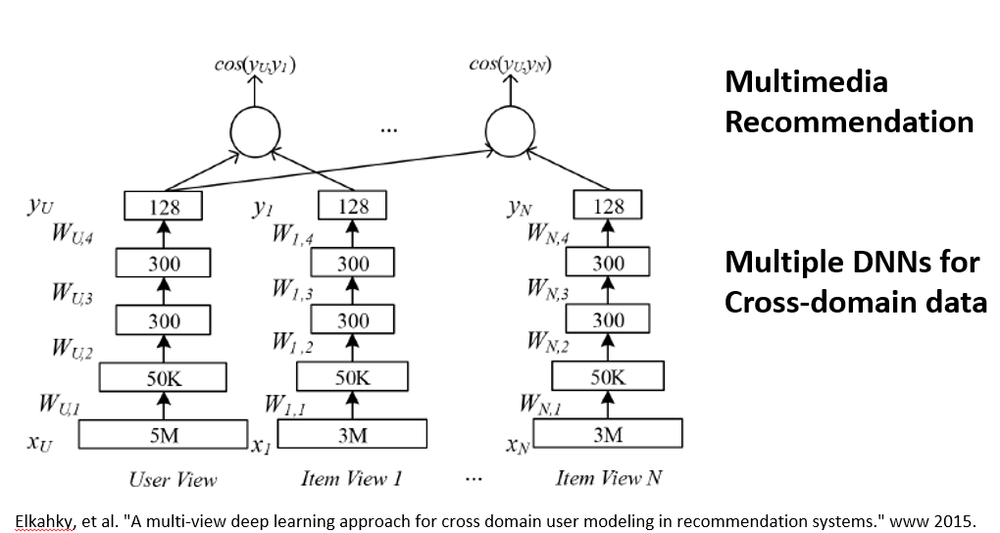

# 深度学习与推荐系统

## 1. 深度学习在推荐系统中的应用

近些年，深度学习在自然语言处理、语义识别等领域都取得了非常大的成就。相对来说，深度学习在推荐系统领域还是处于一个早期的探索阶段。

什么是推荐系统呢？它的主要功能是帮助用户找到符合他需求的个性化的商品。一方面，它可以在如今信息爆炸的时代高效的检索商品，另一方面，它可以快速的帮助用户找到相应的商品，有向导和咨询的功能。

推荐系统会评估用户和商品之间的相关性，会产生用户与商品的一个相关性的score，根据这个score我们就可以把排序最高的商品推荐给用户。其实这本质上就是一个个性化排序问题。

那么，根据推荐系统的不同输入，我们可以把它的基本技术分为这样几类。第一类是比较熟悉的、经常使用的协同过滤的技术，它使用的一方面是用户的信息，另一方面是和用户有相似行为的群体的信息，协同过滤技术就是根据这一群体的信息给用户做推荐。第二类技术是基于内容的推荐，它用到的一方面是用户的信息，另一方面是商品的显性相关属性信息，基于内容的推荐就是向用户推荐他可能浏览或者购买过的相似产品的信息。还有一类技术是混合技术，会运用不同的输入和技术共同进行推荐。

接下来简单看一下传统推荐技术的优点和缺点。基于内容的推荐，它的优点是：第一，简单直接；第二，有可解释的结果；第三，可以比较不同产品之间的相似度。它的缺点是对于从来没有过购买行为的用户会有一个冷启动的问题，另外，基于内容的推荐必须要得到关于产品显性的属性信息。相比较之下，协同过滤技术就不需要这些信息，它是根据用户与和用户行为相似的群体的信息来进行推荐的，它的一个优点就是可以给用户推荐出一些新奇的、用户可能没有购买过的商品。它的缺点，首先也是新用户的冷启动问题，然后是因为用户与商品之间的交互数据不够多，有数据稀疏的问题。最后相对于基于内容的推荐技术，协同过滤技术对结果没有那么好的解释性。

接下来我们就可以看看深度学习是如何应用到推荐系统中的。第一个问题就是，为什么需要深度学习？深度学习能给系统带来什么？这里我们通过学习近些年深度学习大牛们在推荐系统上的研究发展，做了一些总结，下边我们将结合具体的文献和应用来看一看，深度学习如何应用到推荐系统中：

###### 1. 通过深度学习我们可以学习隐藏特征

这里有一个简单的RBM模型，有两层，下面一层是可视层，主要是观察输入的数据。上面一层是隐藏层，它主要是根据之前得到的数据学习和生成隐藏的特征，并还原和预测出可视层的数据。这两个层是全连接的，层内是没有连接的。这样我们就可以把它运用到协同过滤的技术中。用户对电影的评分会出现在可视层中，比如他对电影评分为3，那么第列中第三个格子是黑色的，其他没有，以此类推。可视层的单元数目是等于用户评价过的电影的数目，但是隐藏层单元的数目是固定的，它会通过共享用户评价过的电影的权重最终来实现协同过滤。总的来说，通过这样的方法，我们首先可以观测用户对于电影的评分数据，学习出用户抽象的隐藏特征，然后通过这些特征还原生成出可见层的评分数据，最后根据这些数据在缺失数据中的预测结果来形成最终的推荐结果。

###### 2. 通过深度学习我们可以学习多层次的抽象特征表示

上述的RBM还只是一个两层的浅层模型，进一步地，通过多层的RBM，我们可以学习出多层次的特征表示。这也正是深度学习神奇和强大的地方，通过非监督和监督的学习，我们可以将显示的特征学习出表示不同含义的多层次的抽象特征。图上的例子主要是利用深度学习来解决群组推荐的问题。群组推荐是推荐系统的一个细分领域，是给一个固定的群组做推荐，而群组中是有不同的成员的。通常，我们是把这个群组当做一个虚拟的用户，再利用传统的推荐技术进行推荐。但这里有个问题，因为一个群组包含不同的群组成员，在推荐时我们需要平衡不同成员之间的偏好，要去最大化群组成员的效用，在这幅图右侧，首先使用DBN学习出群组成员的偏好，再进而向上抽象分离出用户个性化的偏好（individualfeature），和集体偏好（collective feature）。在左侧，一个双臂的RBM，将群组的偏好以及用户的集体特征作为可见层来进一步地学习出全面的群组特征。这样通过深度学习，我们可以从数据中学习多层次的抽象特征表示。

###### 3. 深度学习使我们能够使用更多的内容信息进行学习并提出抽象出特征，从而来缓解之前提到的推荐系统中冷启动问题

这里的说的内容信息包括两种：一种内容信息是异质的内容信息，举个例子，用户听音乐，不同歌曲的歌手，类型，流派等文字信息，与歌曲中的音频信号信息，他们是异质的。我们人脑通过可以通过听觉欣赏出这首乐曲是抒情的钢琴曲，还是抖腿的电子乐。而现在通过深度学习的技术，我们也可以将异质的内容学习抽象成同质的语义特征。在NIPS 的这篇文章中，他们通过深度的CNN来学习隐语义特征，图中是根据这些歌手歌曲的学习到的隐语义特征进行聚类的可视化结果，我们可以看到，不同的颜色可以很好地表示不同的音乐流派，例如红色的是hip-hop，绿色的是摇滚，黄色的是pop，蓝色的是电子乐。那么当音乐的显性特征缺失时，我们就可以用这种方法找出它的隐性特征，很好的解决推荐时的冷启动问题。

另一种是跨域的内容信息，当一个用户喜欢看恐怖电影时，他有很大可能也喜欢看恐怖小说；当一个用户出行时喜欢坐头等舱，那他就有很大可能也会订高端的酒店。对于一个用户来说，他在不同域上的特征是相通的，但在不同域上的数据，我们无法直接把他们放在一起运用。通过深度学习可以将不同域上的特征进行不断抽象，对不同域上的数据进行同步的学习。图中的例子是多媒体推荐，它使用多个DNN进行跨域的推荐。通过这种方法，我们可以通过共同学习各个域上的数据抽象出用户在不同域上的隐式特征，从而很好的解决了跨域的冷启动问题。

至此，我们简单小结一下为什么需要深度学习？
- 第一，它可以学习出隐藏的特征
- 第二，它可以学习出多层次的特征表示
- 第三，深度学习可以对异质的或者跨域的内容信息进行学习，解决推荐系统常见的冷启动问题。

###### 4. Wide & Deep Learning on high dimensional Sparse Data

从前边的介绍和应用我们可以看到，深度学习具有很强的特征抽象和学习能力，并且能够使我们应用更多的传统推荐系统无法直接使用的跨域和异质的内容信息。随着大数据时代的到来，对于这些数据的使用已经变得更加容易，因此我们可以将越来越多的数据融合使用到我们的推荐系统中。然而深度模型由于它的高复杂度，对于高纬度的特别是超高纬度的稀疏数据存在比较大的问题，假设我们有1000万维的稀疏特征，隐藏层的数目假设只有1000个，那么就会产生100亿个参数，我们可能将会需要万亿个数据才能有效的训练出这些参数。这在很多场景中是不可能得到的，即使有这么多的数据也需要非常大的计算量来学习这些参数。接下来，我们会详细介绍一个能够在高维稀疏数据上深广模型。这里深广模型，深就是深度模型，其实就是DNN，广就是高维稀疏的LR模型。

首先，我们看一下高维稀疏数据上应用的LR模型。其实我们可以把逻辑回归模型看成一个简单的两层的神经网络，下面的神经网络是它输入的高维稀疏的数据，点亮的神经元为1的、被激活的，未点亮的就是为0、没有被激活的，这里高维稀疏数据的一大特点是大部分的输入数据都是为0（未激活）的。LR模型对于高维稀疏的数据有非常好的性能，并且可以通过交叉特征来学习与目标Label之间的关联。主要的缺点是需要人工的去设计交叉特征，同时模型比较简单，无法很好的挖掘用户与产品需求内在的相关性。

对于深度模型，我们首先要解决上述我们说的深度模型在高维数据上的问题，我们首先来看一个叫做因子机的模型，这个模型由Rendle在2010年提出，之后其凭借优秀的性能广泛的被应用于各类数据挖掘的比赛。

它的一个主要的特点是可以学习任意两个离散特征之间的相关性，并且将其高维的稀疏数据映射到一个低维的固定长度的隐式特征向量上。利用这样的思想，我们可以首先将高维稀疏的离散特征数据映射到低维固定长度的实数特征向量上，再将低维的实数向量作为输入放到深度网络中进行更深更复杂的模型进行训练。

明白了高维稀疏数据上的深度模型以及广度模型（LR），那么这里的深广模型就很简单了，它是广度模型和深度模型的一个联合模型，这里的联合模型指的是一个模型，他们的参数是联合训练的。在深广模型中，深度模型可以挖掘用户与产品，以及各个属性之间的隐性的关系，而广度模型可以使用更少的参数高效地记忆特征与目标Label之间的线性关联。

最后，分享一下我们在这个过程中的几点tricks。首先，我们使用了更多的上下文信息和内容信息，这是可以帮助我们解决推荐系统中的冷启动问题的。第二，Dropout可以防止over-fitting，但是它也可能会带来under-fitting，也就是学习的不够。第三，对于深度模型来说，它可以有很好的效果，但并不是越深越好。我们相信随着深度学习技术的不断成熟，它会在推荐系统中变得越来越流行，并成为推荐系统领域中的一项非常重要的技术。

[原文链接](https://ask.hellobi.com/blog/transwarp/4903)

---

## 2. 
